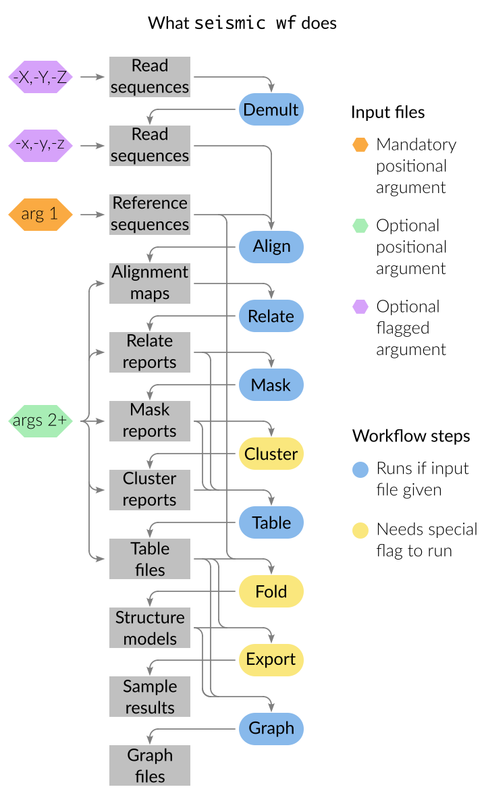

Run SEISMIC-RNA
================================================================================

You can run the SEISMIC-RNA workflow in two ways:

- Run all steps automatically using ``seismic wf`` (see :ref:`wf_wf`).
- Run each step individually using its command (e.g. ``seismic align`` for the
  Align step).

.. _wf_demult:

Demultiplex: Split multiplexed FASTQ files by their barcodes
--------------------------------------------------------------------------------

[WRITE ME]

.. _wf_align:

Align: Trim FASTQ files and align them to reference sequences
--------------------------------------------------------------------------------

Align: Input files
^^^^^^^^^^^^^^^^^^^^^^^^^^^^^^^^^^^^^^^^^^^^^^^^^^^^^^^^^^^^^^^^^^^^^^^^^^^^^^^^

Align input file: Reference sequences
""""""""""""""""""""""""""""""""""""""""""""""""""""""""""""""""""""""""""""""""

You need one file of reference sequences in FASTA format (for details on this
format, see :doc:`../formats/data/fasta`).
If your file has characters or formatting incompatible with SEISMIC-RNA, then
you can fix it using the :doc:`./cleanfa` tool.

Align input file: Read sequences
""""""""""""""""""""""""""""""""""""""""""""""""""""""""""""""""""""""""""""""""

Your read sequences must be in FASTQ format (see :doc:`../formats/data/fastq`
for details on this format).

Reads can be single-end or paired-end
''''''''''''''''''''''''''''''''''''''''''''''''''''''''''''''''''''''''''''''''

You can align FASTQ files of single- and paired-end reads with SEISMIC-RNA.
(For definitions of single- and paired-end reads, see :ref:`fastq_endedness`).
SEISMIC-RNA requires that single- and paired-end reads not be mixed within one
file, but it can accept different types of reads in separate FASTQ files.

Reads can come from whole or demultiplexed samples
''''''''''''''''''''''''''''''''''''''''''''''''''''''''''''''''''''''''''''''''

You can align FASTQ files that come from a whole sample (possibly containing
multiple RNA sequences) or that have been demultiplexed before alignment so
that they contain reads from only one RNA sequence.
For more information on demultiplexing and how to perform it if needed, see
:ref:`wf_demult`.

How to specify the endedness and source of reads
''''''''''''''''''''''''''''''''''''''''''''''''''''''''''''''''''''''''''''''''

Specify the endedness (single-end, paired-end interleaved, or paired-end in
separate files) and source of the reads (whole or demultiplexed sample) in a
FASTQ file by giving the file path after the appropriate option:

========================== ===================== =======================
Endedness                  Whole Sample          Demultiplexed
========================== ===================== =======================
paired-end, separate files ``--fastqx`` (``-x``) ``--dmfastqx`` (``-X``)
paired-end, interleaved    ``--fastqy`` (``-y``) ``--dmfastqy`` (``-Y``)
single-end                 ``--fastqz`` (``-z``) ``--dmfastqz`` (``-Z``)
========================== ===================== =======================

For example, you could type ``-z {myfile}`` to input a FASTQ file of single-end
reads from a whole sample or ``-X {myfile1} -X {myfile2}`` to input two FASTQ
files of paired-end reads from a demultiplexed sample, replacing ``{myfile}``
with the actual path(s) of your file(s).

.. note::
    If you have paired-end reads in separate FASTQ files (``-x`` or ``-X``),
    then you must give both files of 1st and 2nd mates.
    See :ref:`fastq_pair` for instructions.

How to align one FASTQ file (single-end or interleaved paired-end reads)
''''''''''''''''''''''''''''''''''''''''''''''''''''''''''''''''''''''''''''''''

To align a FASTQ of single-end reads from a whole sample, use ``-z``::

    seismic align {refs.fa} -z {sample.fq.gz}

where ``{refs.fa}`` is the path to your FASTA file of reference sequences and
``{sample.fq.gz}`` is the path to your FASTQ file of the sample.

For a FASTQ of paired-end, interleaved reads that were demultiplexed, use ``-Y``
instead::

    seismic align {refs.fa} -Y {sample/ref.fq.gz}

where ``{sample/ref.fq.gz}`` is the path to your FASTQ file containing reads
from only one reference in the sample.

.. _fastq_pair:

How to align a pair of FASTQ files (paired-end reads in separate files)
''''''''''''''''''''''''''''''''''''''''''''''''''''''''''''''''''''''''''''''''

If your reads are paired-end and you have one FASTQ file containing all 1st
mates and another containing all 2nd mates, then you will need to provide both
FASTQ files.
There are two methods:

1.  Use ``-x``/``-X`` twice, once per FASTQ file::

        seismic align {refs.fa} -x {sample_R1.fq.gz} -x {sample_R2.fq.gz}

    where ``{sample_R1.fq.gz}`` and ``{sample_R2.fq.gz}`` are the paths to your
    FASTQ files of the 1st and 2nd mates, respectively.

2.  Make a new directory, move both FASTQ files into that directory, and provide
    the path to that directory with ``-x``/``-X``::

        mkdir {sample}
        mv {sample_R1.fq.gz} {sample_R2.fq.gz} {sample}
        seismic align {refs.fa} -x {sample}

    where ``{sample}`` is the new directory for both FASTQ files.

How to align multiple FASTQ files or pairs of paired-end FASTQ files
''''''''''''''''''''''''''''''''''''''''''''''''''''''''''''''''''''''''''''''''

There are three ways to align multiple FASTQ files (or pairs thereof):

- **Use options more than once.**
  You can repeat any of ``-x``/``-y``/``-z``/``-X``/``-Y``/``-Z``, as well as
  mix them in one command.
  For example, to align one pair of paired-end FASTQ files (sample 1), one
  interleaved paired-end FASTQ file (sample 2), and two single-end FASTQ files
  (samples 3 and 4), you could type ::

    seismic align {refs.fa} -x {sample1_R1.fq.gz} -x {sample1_R2.fq.gz} -y {sample2.fq.gz} -z {sample3.fq.gz} -z {sample4.fq.gz}

  This method is most useful when you have a small number of FASTQ files.

- **Group FASTQ files of the same type into a directory.**
  Suppose you have 63 pairs of FASTQ files, with the files of mate 1s named
  ``sample-1_R1.fq.gz`` to ``sample-63_R1.fq.gz`` and the files of mate 2s named
  ``sample-1_R2.fq.gz`` to ``sample-63_R2.fq.gz``; plus demultiplexed single-end
  reads from three samples (I-III) and six references (A-F), named
  ``sample-I/ref-A.fq.gz`` to ``sample-III/ref-F.fq.gz``).
  You can align all of them with one command if you move the whole-sample,
  paired-end FASTQ files into their own directory, and the demultiplexed,
  single-end FASTQ files into another directory, and then give each directory
  after the appropriate options (``-x`` and ``-Z``, respectively)::

    mkdir {paired}
    mv sample-*_R?.fq.gz {paired}
    mkdir {dm-single}
    mv sample-I* {dm-single}
    seismic align {refs.fa} -x {paired} -Z {dm-single}

  This method is most useful when you have many FASTQ files.

- **Combine the first two methods.**
  Suppose you are working on two projects, have generated a set of many FASTQ
  files for each project, and want to process both sets.
  Currently, the FASTQ files for projects 1 and 2 are in directories ``proj1``
  and ``proj2``, and you want to keep them separate.
  You can process both directories with one command::

    seismic align {refs.fa} -x proj1 -x proj2

  This method is most useful when you have multiple directories of FASTQ files
  that you would like to keep separate.

.. note::
    If you give a directory for any of the FASTQ options, then SEISMIC-RNA will
    search for FASTQ files recursively, with no limit to the depth.

Align: Settings
^^^^^^^^^^^^^^^^^^^^^^^^^^^^^^^^^^^^^^^^^^^^^^^^^^^^^^^^^^^^^^^^^^^^^^^^^^^^^^^^

Align setting: Quality score encoding
""""""""""""""""""""""""""""""""""""""""""""""""""""""""""""""""""""""""""""""""

Your FASTQ files may encode quality scores in several schemes (for details, see
:ref:`phred_encodings`).
Modern Illumina sequencers use Phred+33 encoding, the default in SEISMIC-RNA.
To change the quality score encoding, use ``--phred-enc``.

.. note::
    If your FASTQ files do not use the Phred+33 encoding, then you must
    specify the correct Phred score encoding, or else Cutadapt and/or
    Bowtie 2 can produce incorrect output or fail outright.

If you do not know the encoding scheme of your FASTQ files, then you can process
them with `FastQC`_ and check the "Encoding" field in the "Basic Statisics" part
of the FastQC report:

- If the Encoding field says ``Illumina 1.0`` to ``1.7``, then your FASTQ files
  use Phred+64 encoding (``--phred-enc 64``).
- If the Encoding field says ``Illumina 1.8`` or greater, then your FASTQ files
  use Phred+33 encoding (``--phred-enc 33``, the default).
- Otherwise, you will need to search elsewhere for your encoding scheme.

Align setting: Quality assessment with FastQC
""""""""""""""""""""""""""""""""""""""""""""""""""""""""""""""""""""""""""""""""

To check the quality of your FASTQ files, SEISMIC-RNA runs `FastQC`_ by default.
To disable FastQC, use ``--no-fastqc``.
You can also enable automatic unzipping of the zipped output files from FastQC
with ``--qc-extract``.

Align setting: Trimming reads with Cutadapt
""""""""""""""""""""""""""""""""""""""""""""""""""""""""""""""""""""""""""""""""

To trim adapters and low-quality base calls before alignment, SEISMIC-RNA runs
`Cutadapt`_ by default.
To disable trimming, use ``--no-cut``.

How to trim adapter sequences
''''''''''''''''''''''''''''''''''''''''''''''''''''''''''''''''''''''''''''''''

Your reads may contain unwanted adapters (especially near their 3' ends), which
can cause problems such as misalignment (alignment to the wrong location).
Your adapter sequences depend on how your samples were prepared for sequencing
(i.e. on your library prep kit) and on your sequencing platform.
Since Illumina sequencers are the most widely used for mutational profiling,
SEISMIC-RNA defaults to the standard, minimal adapter sequences for Illumina
for both read 1 and (if paired-end) read 2:

- 5': ``GCTCTTCCGATCT``
- 3': ``AGATCGGAAGAGC``

If your samples have other adapters, then you can specify their sequences using

====== ====== ==============
 Side   Read   Option
====== ====== ==============
 5'     1      ``--cut-g1``
 5'     2      ``--cut-g2``
 3'     1      ``--cut-a1``
 3'     2      ``--cut-a2``
====== ====== ==============

.. _quality_trimming:

How to trim low-quality base calls
''''''''''''''''''''''''''''''''''''''''''''''''''''''''''''''''''''''''''''''''

Your reads may contain low-quality base calls (especially near their 3' ends),
which can cause misalignment and excessive mutations.
By default, SEISMIC-RNA trims base calls with quality scores less than 25, which
corresponds to a probability of 10\ :sup:`-2.5` = 0.3% that the base call is
incorrect (for an explanation, see :ref:`phred_encodings`).
You can set the quality threshold with ``--min-phred``.
We discourage using a quality threshold less than 25 because doing so could lead
to a background error rate that is too high for accurate mutational profiling
(e.g. 1% with ``--min-phred 20``), especially if you want to cluster your reads.

How to trim extra dark cycles (for Illumina two-channel chemistry)
''''''''''''''''''''''''''''''''''''''''''''''''''''''''''''''''''''''''''''''''

Illumina sequencers using `two-channel chemistry`_ (e.g. NextSeq, NovaSeq, iSeq)
interpret the lack of color from either channel as G.
Consequently, if a DNA molecule is shorter than the read length, then the final
cycles of sequencing will produce no light and be `called as a string Gs`_.
Using ``--cut-nextseq`` tells Cutadapt to `trim high-quality Gs`_
from the 3' end of every read.
Trimming dark cycles can improve alignment in end-to-end mode, but it also trims
real G bases (which cannot be distinguished from artifactual ones) from the 3'
ends of reads.

How to further customize read trimming
''''''''''''''''''''''''''''''''''''''''''''''''''''''''''''''''''''''''''''''''

Refer to :ref:`cli_align` for the full list of options that SEISMIC-RNA can use
with Cutadapt, and the `Cutadapt reference guide`_ for details on each.
These options suffice for most users.
If you need more customization, then you can trim your FASTQ files externally
and then perform alignment within SEISMIC-RNA, using ``--no-cut`` to disable
additional trimming.

Align setting: Mapping reads with Bowtie 2
""""""""""""""""""""""""""""""""""""""""""""""""""""""""""""""""""""""""""""""""

SEISMIC-RNA uses `Bowtie 2`_ to align your reads to your reference sequences.

How to pre-build a Bowtie 2 index (optional)
''''''''''''''''''''''''''''''''''''''''''''''''''''''''''''''''''''''''''''''''

Bowtie 2 requires the FASTA file of reference sequences to be indexed.
You can have SEISMIC-RNA build the index for you automatically (the default) or
index your FASTA file manually.
With automatic indexing, SEISMIC-RNA builds the index in a temporary directory
and deletes it after alignment finishes.
This option is ideal for small sets of references (i.e. up to several hundred
sequences of several thousand nucleotides each) because building the index will
take on the order of seconds to minutes.
However, for large sets of references (e.g. an entire mammalian transcriptome),
building the index can take on the order of hours.
In this case, we recommend building the index yourself using the command ::

    bowtie2-build {refs}.fa {refs}

where ``{refs}.fa`` is the path of your FASTA file and ``{refs}`` is the path
without the FASTA file extension.
See the `Bowtie 2 Indexer manual`_ for more information on building an index.
Note that, while Bowtie 2 does not require the index to have the same name as
the FASTA file, SEISMIC-RNA does, so make sure that you use the same path for
the FASTA file and the index, except that the index path should not have the
FASTA file extension.

Indexing will generate six files with the extensions ``.1.bt2``, ``.2.bt2``,
``.3.bt2``, ``.4.bt2``, ``.rev.1.bt2``, and ``.rev.2.bt2``.
As long as all six files are in the same directory as and have the same name
(minus the file extension) as the FASTA file, SEISMIC-RNA will use the index.
Otherwise, SEISMIC-RNA will build and use a temporary index.

.. note::
    If you use a pre-built Bowtie 2 index, then SEISMIC-RNA does *not* verify
    that the index was actually built from the FASTA file of the same name.
    Discrepancies between the FASTA file and the index files can crash the Align
    and Relate steps or produce erroneous results.

How to choose between local and end-to-end alignment
''''''''''''''''''''''''''''''''''''''''''''''''''''''''''''''''''''''''''''''''

You can align either whole reads (end-to-end mode) or the part of each read that
aligns best to the reference (local mode).
See the `description of alignment modes in Bowtie 2`_ for more details.

Generally, end-to-end mode yields spurious mutations (false positives) at the
ends of reads if the reads contain artifacts such as low-quality base calls or
untrimmed or improperly trimmed adapters.
Conversely, local mode misses real mutations (false negatives) within several
nucleotides of the ends of reads because such mutations cannot be part of the
best local alignment, which penalizes mutations and rewards matches.

For RNA mutational profiling, false positives generally cause more problems than
do false negatives, so SEISMIC-RNA uses local mode (``--bt2-local``) by default.
Use end-to-end mode (``--bt2-end-to-end``) only if you have a compelling reason
to do so (e.g. if you must quantify mutations at the ends of reads) and only
after carefully trimming any extraneous sequences from the ends of the reads.

How to align paired-end reads
''''''''''''''''''''''''''''''''''''''''''''''''''''''''''''''''''''''''''''''''

If your reads are paired-end, then you have additional options for keeping or
discarding read pairs depending on how the two reads in the pair (called mates)
align relative to each other.
Bowtie 2 considers mates to align "concordantly" when their relative positions
match expectations and "discordantly" otherwise.
See the `Bowtie 2 manual for details on concordant/discordant alignments`_.
By default, SEISMIC-RNA keeps only concordantly aligned pairs.
To include discordantly aligned pairs too, add ``--bt2-discordant``.

Several options control which types of alignments are considered concordant
versus discordant.

You can specify where mates should align relative to each other: mates may
`overlap partially or completely, or dovetail`_.
By default, overlaps (partial and complete) are considered concordant, while
dovetailing is considered discordant.
You can treat complete overlaps as discordant with ``--bt2-no-contain``, or
dovetailed mates as concordant with ``--bt2-dovetail``.
Pairs that overlap partially (without dovetailing) are always concordant in
SEISMIC-RNA.

You can also specify the orientation of paired mates using ``--bt2-orient``.
The choices are ``fr`` (the 5'-most mate is forward, the 3'-most is reversed),
``rf`` (the 5'-most mate is reversed, the 3'-most is forward), or ``ff`` (both
mates are forward).
The default is ``fr`` (and if you are not sure which orientation you need, then
you probably need the default).

.. note::
    First, ``--bt2[-no]-contain``, ``--bt2[-no]-dovetail``, and ``--bt2-orient``
    choose which paired-end alignments count as concordant or discordant.
    If discordant, then ``--bt2-[no-]discordant`` choose whether to keep them.
    Using ``--bt2-no-contain`` and ``--bt2-discordant``, for example, would make
    alignments where one mate fully contains the other discordant (because of
    ``--bt2-no-contain``) but still kept (because of ``--bt2-discordant``),
    despite what the name "no-contain" would imply.

You can also enable `mixed mode`_ with ``--bt2-mixed``.
In mixed mode, if two mates fail to align as a pair, then Bowtie 2 will attempt
to align each mate individually, like a single-end read.
(It is possible in mixed mode for only one mate in a pair to align.)

How to filter aligned reads
''''''''''''''''''''''''''''''''''''''''''''''''''''''''''''''''''''''''''''''''

You can filter alignments by `alignment score`_ and `mapping quality`_.

`Alignment score`_ measures how *well* a read aligns to *one specific location*
in *one reference sequence* and depends on the number of matches, substitutions,
and gaps, using the score parameters.
You can specify the minimum alignment score for local and end-to-end modes using
``--bt2-score-min-loc`` and ``--bt2-score-min-e2e``, respectively.
See the `section of the Bowtie 2 manual on alignment scores`_ for advice.

`Mapping quality`_ measures how *unique* an alignment is among *all locations*
in *all reference sequences*: high if the read aligns with a high alignment
score to exactly one location, low quality if it aligns with similar alignment
scores to multiple locations in the reference (and thus it is hard to determine
a single location where the read aligns).
The default minimum mapping quality is 25, meaning that the probability that the
chosen location is incorrect is 10\ :sup:`-2.5` = 0.3%.
You can change the minimum mapping quality using ``--min-mapq``.

How to filter by number of aligned reads
''''''''''''''''''''''''''''''''''''''''''''''''''''''''''''''''''''''''''''''''

Alignment maps containing very few reads are not generally useful for mutational
profiling, due to low coverage per position.
When aligning to many references (e.g. an entire transcriptome), most references
will receive few reads, producing many output files that would be unusable for
further processing.
To prevent unusable files from cluttering your output directory, you can choose
to have alignment map files with insufficient reads deleted automatically.
The default minimum is 1000 reads, which you can change using ``--min-reads``.
With no minimum (``--min-reads 0``), no files are deleted automatically.

How to further customize alignment
''''''''''''''''''''''''''''''''''''''''''''''''''''''''''''''''''''''''''''''''

See :ref:`cli_align` for the full list of options that SEISMIC-RNA can use with
Bowtie 2, and the `Bowtie 2 manual`_ for details on each of these options.
These options suffice for most users.
If you need more customization, then you can align your FASTQ files externally
and pass the alignment maps into SEISMIC-RNA at the step :ref:`wf_relate`.

.. _bam_vs_cram:

Align setting: Format of alignment maps
""""""""""""""""""""""""""""""""""""""""""""""""""""""""""""""""""""""""""""""""

You can choose to output alignment map files in either BAM or CRAM format.
For information on these file formats, see :doc:`../../formats/data/xam`.
The default is CRAM (``--cram``); you can switch to BAM using ``--bam``.

Alignment maps in CRAM format are smaller than their BAM counterparts, and hence
better suited to long-term storage.
However, the better compression of CRAM files comes at three costs:

- A CRAM file must be accompanied by a FASTA file storing the sequence of every
  reference that appears in the header of the CRAM file.
  A CRAM file stores only the relative path to its FASTA file, not the sequence
  information, which enables the CRAM file to be much smaller than it would be
  if it did need to contain its own sequences.
  Because the FASTA file existed before and during the alignment, having this
  FASTA file accompany the CRAM file usually incurs no extra cost.
  However, moving or deleting the FASTA will break the CRAM file.
  As a safeguard against this fragility, SEISMIC-RNA keeps a copy of the FASTA
  file in the same directory as the output CRAM file.
  Creating an actual copy would require more storage space and defeat the point
  of CRAM's smaller file size, so SEISMIC-RNA actually makes a `hard link`_ --
  not a copy -- which requires minimal extra space.
  In some circumstances, making a hard link can fail, in which case SEISMIC-RNA
  will resort to copying the FASTA file instead.
- Reading and writing CRAM files is slower than for BAM files due to the extra
  effort needed for compressing and decompressing CRAM files.
- In the `CIGAR strings`_, distinction between reference matches (``=``) and
  substitutions (``X``) is lost upon compressing to CRAM format.
  Thus, the Relate step must perform extra work to determine if each non-indel
  position is a match or substitution, which makes it run more slowly than it
  would if the distinction had been preserved.

In general, use CRAM format if minimizing the size of your alignment map files
is a priority, especially for long-term storage.
Use BAM format to make the ``align`` and ``relate`` steps run faster, and to
make the output files more portable (since BAM files are self-contained, while
CRAM files will break without the FASTA file that accompanies them).

Align: Output files
^^^^^^^^^^^^^^^^^^^^^^^^^^^^^^^^^^^^^^^^^^^^^^^^^^^^^^^^^^^^^^^^^^^^^^^^^^^^^^^^

All output files except FastQC reports are written to ``{out}/{sample}/align``,
where ``{out}`` is your output directory and ``{sample}`` is the sample name.

Align output file: FastQC reports
""""""""""""""""""""""""""""""""""""""""""""""""""""""""""""""""""""""""""""""""

If you run FastQC, then its report files go into ``{out}/{sample}/qc``.
The directory ``{out}/{sample}/qc/initial`` contains the FastQC reports for your
initial FASTQ files, before trimming.
If you also run trimming, then reports for the post-trimmed FASTQ files go into
``{out}/{sample}/qc/trimmed``.

In each directory, FastQC outputs ``{fq_name}_fastqc.html`` (the FastQC report)
and ``{fq_name}_fastqc.zip`` (extra information), where ``{fq_name}`` comes from
the original FASTQ file.
If you add ``--qc-extract``, then each ``{fq_name}_fastqc.zip`` will be unzipped
to the directory ``{fq_name}_fastqc``.
For details on these outputs, see the documentation for `FastQC`_.

Align output file: Alignment maps
""""""""""""""""""""""""""""""""""""""""""""""""""""""""""""""""""""""""""""""""

Alignment maps store the location in the reference sequence to which each read
aligned, plus the Phred quality scores, mapping quality, and mutated positions.
(For more information on alignment maps, see :doc:`../formats/data/xam`.)
SEISMIC-RNA outputs alignment maps where every read aligns to the same reference
(although this is not a restriction outside of SEISMIC-RNA).
Each alignment map is written to ``{ref}.{xam}``, where ``{ref}`` is the name of
the reference to which the reads aligned, and ``{xam}`` is the file extension
(depending on the selected format).
SEISMIC-RNA can output alignment maps in either BAM or CRAM format.
For a comparison of these formats, see :ref:`bam_vs_cram`.

Align output file: Reference sequences
""""""""""""""""""""""""""""""""""""""""""""""""""""""""""""""""""""""""""""""""

If you choose to output alignment maps in CRAM format, then you also get a FASTA
file(s) of the reference sequence(s) alongside the CRAM files.
If the reads came from a whole sample, then a single FASTA file with the same
name as the input FASTA file will be output.
The output file will be a `hard link`_ to the input file, if possible, to avoid
consuming unnecessary storage space.
If the reads were demultiplexed before alignment, then for each CRAM file, a
FASTA file with the same name (up to the file extension) will be output.
In both cases, each FASTA file will be indexed using `samtools faidx`_ to speed
up reading the CRAM files.
If you choose to output alignment maps in BAM format, then you get (and need)
no FASTA files alongside them.

.. _wf_unaligned:

Align output file: Unaligned reads
""""""""""""""""""""""""""""""""""""""""""""""""""""""""""""""""""""""""""""""""

In addition to the alignment maps, SEISMIC-RNA outputs FASTQ file(s) of reads
that Bowtie 2 could not align:

- Each whole-sample FASTQ file of single-end (``-z``) or interleaved (``-y``)
  reads yields one file: ``unaligned.fq.gz``
- Each pair of whole-sample FASTQ files of 1st and 2nd mates (``-x``) yields two
  files: ``unaligned.fq.1.gz`` and ``unaligned.fq.2.gz``
- Each demultiplexed FASTQ file of single-end (``-Z``) or interleaved (``-Y``)
  reads yields one file: ``{ref}__unaligned.fq.gz``
- Each pair of demultiplexed FASTQ files of 1st and 2nd mates (``-X``) yields
  two files: ``{ref}__unaligned.fq.1.gz`` and ``{ref}__unaligned.fq.2.gz``

where ``{ref}`` is the reference for demultiplexed FASTQ files.

You can disable outputting unaligned using ``--bt2-no-un``.

Align output file: Align report
""""""""""""""""""""""""""""""""""""""""""""""""""""""""""""""""""""""""""""""""

SEISMIC-RNA also writes a report file, ``align-report.json``, that records the
settings you used for running the Align step and summarizes the results.
See :doc:`../formats/report/align` for more information.

Check the number of reads that aligned overall
--------------------------------------------------------------------------------

Under "Number of reads after alignment", the report says how many single-end
and/or paired-end reads were in the FASTQ file(s), and how many reads aligned.
This information is copied verbatim from the `alignment summary`_ of Bowtie 2;
see its documentation for more details.
For paired-end reads, each pair counts as one read.

Check the number of reads that aligned to each reference
--------------------------------------------------------------------------------

Under "Number of reads aligned by reference", the report lists every reference
in your input FASTA file and the number of reads that aligned to it.
For paired-end reads, each pair counts as one read.

Align: Troubleshoot and optimize
^^^^^^^^^^^^^^^^^^^^^^^^^^^^^^^^^^^^^^^^^^^^^^^^^^^^^^^^^^^^^^^^^^^^^^^^^^^^^^^^

Alignment produces alignment map files too slowly
""""""""""""""""""""""""""""""""""""""""""""""""""""""""""""""""""""""""""""""""

First, try running the Align step using more processors (with ``--max-procs``),
at the cost of using more memory.
If, as a result, :ref:`align_crash_hang`, then try adjusting the settings of
Bowtie 2 to increase the speed, at the risk of overlooking valid alignments.
See :ref:`cli_align` for the Bowtie 2 settings you can adjust in SEISMIC-RNA,
and the `Bowtie 2 manual`_ for more detailed descriptions.

.. _align_crash_hang:

Alignment crashes or hangs without producing alignment map files
""""""""""""""""""""""""""""""""""""""""""""""""""""""""""""""""""""""""""""""""

Most likely, your system has run out of memory.
You can confirm using a program that monitors memory usage (such as ``top`` in a
Linux/macOS terminal, Activity Monitor on macOS, or Task Manager on Windows).
If so, then rerun the Align step using fewer processors (with ``--max-procs``)
to limit the memory usage, at the cost of slower alignment.

Fewer reads aligned than you expected
""""""""""""""""""""""""""""""""""""""""""""""""""""""""""""""""""""""""""""""""

Try the following steps (in this order):

1.  Ensure you are using Bowtie version 2.5.1 or later (version 2.5.0 has a bug
    that affects alignment rate).
    You can check the version with ``bowtie2 --version | head -n 1``.
2.  Double check that your FASTA file has the correct reference sequence(s) and
    that, if you pre-built the Bowtie 2 index before running ``seismic align``,
    that you indexed the correct FASTA file.
3.  Examine the reads that failed to align (see :ref:`wf_unaligned`).
    Choose several reads randomly, copy one or two 20 - 40 nt segments from the
    middle of each read, and check if the segments come from any known sources
    by querying `BLAST`_ (or similar tools).
    Identifying the sources of unaligned reads can help determine the cause of
    the problem (e.g. contamination with ribosomal RNA or foreign nucleic acids
    such as from *Mycoplasma*) and whether the reads that did align are usable.

.. _wf_relate:

Relate: Compute relationships between references and aligned reads
--------------------------------------------------------------------------------

Relate: Input files
^^^^^^^^^^^^^^^^^^^^^^^^^^^^^^^^^^^^^^^^^^^^^^^^^^^^^^^^^^^^^^^^^^^^^^^^^^^^^^^^

.. _relate_refs:

Relate input file: Reference sequences
""""""""""""""""""""""""""""""""""""""""""""""""""""""""""""""""""""""""""""""""

You need one file of reference sequences in FASTA format (for details on this
format, see :doc:`../formats/data/fasta`).
If your file has characters or formatting incompatible with SEISMIC-RNA, then
you can fix it using the :doc:`./cleanfa` tool.

Relate input file: Alignment maps
""""""""""""""""""""""""""""""""""""""""""""""""""""""""""""""""""""""""""""""""

You can provide any number of alignment map files, each of which must be in SAM,
BAM, or CRAM format (collectively, "XAM" format).
See :doc:`../formats/data/xam` for more information.

.. note::
    The references in the FASTA file must match those to which the reads in the
    alignment map were aligned.
    Discrepancies can cause the Relate step to fail or produce erroneous output.
    You can assume that the references match if you use the same (unmodified)
    FASTA file for both the ``align`` and ``relate`` commands, or if you run
    both steps using the command ``seismic wf``.

Provide the alignment map files as a list after the FASTA file.
See :doc:`./inputs` for ways to list multiple files.
For example, to compute relation vectors for reads from ``sample-1`` aligned to
references ``ref-1`` and ``ref-2``, and from ``sample-2`` aligned to reference
``ref-1``, use the following command::

    seismic relate {refs.fa} sample-1/align/ref-1.cram sample-1/align/ref-2.cram sample-2/align/ref-1.cram

where ``{refs.fa}`` is the path to the file of reference sequences.

Relate: Settings
^^^^^^^^^^^^^^^^^^^^^^^^^^^^^^^^^^^^^^^^^^^^^^^^^^^^^^^^^^^^^^^^^^^^^^^^^^^^^^^^

Relate settings shared with alignment
""""""""""""""""""""""""""""""""""""""""""""""""""""""""""""""""""""""""""""""""

Because you can begin the SEISMIC-RNA workflow at ``seismic align`` or, if you
already have alignment map files, can begin at ``seismic relate``, these two
commands share several options: ``--phred-enc``, ``--min-mapq``,``--min-reads``,
and ``--out-dir`` have the same functions in both commands.

Relate setting: Minimum Phred score
""""""""""""""""""""""""""""""""""""""""""""""""""""""""""""""""""""""""""""""""

In the Relate step, you can flag bases with low quality scores as ambiguous, as
if they were ``N``\s.
This step serves a purpose similar to that of quality trimming during the Align
step (see :ref:`quality_trimming`).
The difference is that quality trimming removes low-quality bases by shortening
reads from their ends, while the minimum quality score in the Relate step flags
low-quality bases located anywhere in the reads, while preserving read lengths.
See :ref:`relate_low_qual` for a more detailed description of how this works.

To set the minimum quality score, use ``--min-phred``.
The default is 25, meaning that base calls with a probabilities of at least
10\ :sup:`-2.5` = 0.3% of being incorrect are flagged as ambiguous.
(See :ref:`phred_encodings` for an explanation of quality scores.)
For example, if a ``T`` is called as a match with a quality score of 20, then it
would be flagged as possibly a match and possibly a subsitution to A, C, or G.

Relate setting: Ambiguous insertions and deletions
""""""""""""""""""""""""""""""""""""""""""""""""""""""""""""""""""""""""""""""""

When insertions and deletions (indels) occur in repetitive regions, determining
which base(s) were inserted or deleted can be impossible due to the repetitive
reference sequence itself, even if the reads were perfectly free of errors.
To handle ambiguous indels, SEISMIC-RNA introduces a new algorithm that finds
all possible indels that could have produced the observed read (for details on
this algorithm, see :doc:`../algos/ambrel`).
This algorithm is enabled by default.
If you do not need to identify ambiguous indels, then you can disable this
algorithm with ``--no-ambrel``, which will speed up the Relate step at the cost
of reducing its accuracy on indels.

Relate setting: Batch size
""""""""""""""""""""""""""""""""""""""""""""""""""""""""""""""""""""""""""""""""

In the Relate step, you can divide up your data into batches to speed up the
analysis and reduce the amount of memory needed.
For an explanation of batching and how to use it, see :ref:`batches`.
You can specify batch size (in millions of base calls) using ``--batch-size``,
which is ``64.0`` (64 million base calls) by default.
Relate uses the batch size to calculate the number of reads in each batch.
The number of relationship bytes per batch, *B*, is the number of relationship
bytes per read, *L*, times the number of reads per batch, *N*:

*B* = *LN*

Since *L* is the length of the reference sequence and *B* is ``--batch-size``:

*N* = *B*/*L*

.. note::
    SEISMIC-RNA will aim to put exactly *N* reads in each batch but the last
    (the last batch can be smaller because it has just the leftover reads).
    If the reads are single-ended or were not aligned in `mixed mode`_, then
    every batch but the last will contain exactly *N* reads.
    If the reads are paired-ended and were aligned in `mixed mode`_, then
    batches may contain more than *N* reads, up to a maximum of 2\ *N* in the
    extreme case that only one read aligned in every mate pair.

Relate: Output files
^^^^^^^^^^^^^^^^^^^^^^^^^^^^^^^^^^^^^^^^^^^^^^^^^^^^^^^^^^^^^^^^^^^^^^^^^^^^^^^^

All output files go into the directory ``{out}/{sample}/relate/{ref}``, where
``{out}`` is the output directory, ``{sample}`` is the sample, and ``{ref}`` is
the name of the reference.

Relate output file: Batch of relation vectors
""""""""""""""""""""""""""""""""""""""""""""""""""""""""""""""""""""""""""""""""

Each batch of relation vectors contains a ``RelateBatchIO`` object and is saved
to the file ``relate-batch-{num}.brickle``, where ``{num}`` is the batch number.
See :doc:`../data/relate/relate` for more information on the data structure.
See :doc:`../formats/data/brickle` for more information on brickle files.

Relate output file: Batch of read names
""""""""""""""""""""""""""""""""""""""""""""""""""""""""""""""""""""""""""""""""

Within each batch, the relate step assigns an index (a nonnegative integer) to
each read and writes a file mapping the indexes to the read names.
Each batch of read names contains a ``QnamesBatchIO`` object and is saved to the
file ``qnames-batch-{num}.brickle``, where ``{num}`` is the batch number.
See :doc:`../data/relate/qnames` for more information on the data structure.
See :doc:`../formats/data/brickle` for more information on brickle files.

Relate output file: Reference sequence
""""""""""""""""""""""""""""""""""""""""""""""""""""""""""""""""""""""""""""""""

The relate step writes the reference sequence as a ``RefseqIO`` object to the
file ``refseq.brickle``.
See :doc:`../data/relate/refseq` for more information on the data structure.
See :doc:`../formats/data/brickle` for more information on brickle files.

Relate output file: Relate report
""""""""""""""""""""""""""""""""""""""""""""""""""""""""""""""""""""""""""""""""

SEISMIC-RNA also writes a report file, ``relate-report.json``, that records the
settings you used for running the Relate step and summarizes the results.
See :doc:`../formats/report/relate` for more information.

Relate: Troubleshoot and optimize
^^^^^^^^^^^^^^^^^^^^^^^^^^^^^^^^^^^^^^^^^^^^^^^^^^^^^^^^^^^^^^^^^^^^^^^^^^^^^^^^

If you encounted problems during the Relate step, then the most likely cause is
that the FASTA file or settings you used for the Relate step differ from those
that you used during alignment.

Relate troubleshooting: Insufficient reads in {file} ...
""""""""""""""""""""""""""""""""""""""""""""""""""""""""""""""""""""""""""""""""

This error means that you provided a SAM/BAM/CRAM file containing fewer reads
than the minimum number set by ``--min-reads`` (``-n``).
There are two common causes of this error:

- You ran ``seismic align`` and ``seismic relate`` separately (instead of with
  ``seismic wf``), and you used a larger value for ``--min-reads`` during the
  Relate step than the Align step.
  To check if this happened, open your report files from Align and Relate and
  see if the field "Minimum number of reads in an alignment map" has a larger
  value in the Relate report.
- You ran alignment outside of SEISMIC-RNA or obtained alignment map files from
  an external source, and some of the alignment maps have insufficient reads.

The solution for the problem is to ensure that you run ``seismic relate`` with
``--min-reads`` set to the minimum number of reads you actually want during the
Relate step.
As long as you do so, you may ignore error messages about insufficient reads,
since these messages just indicate that SEISMIC-RNA is skipping alignment maps
with insufficient reads, which is exactly what you want to happen.

Relate troubleshooting: Read {read} mapped with a quality score {score} ...
""""""""""""""""""""""""""""""""""""""""""""""""""""""""""""""""""""""""""""""""

This error means that a read inside an alignment file aligned with a mapping
quality lower than the minimum set by ``--min-mapq``.
There are two common causes of this error:

- You ran ``seismic align`` and ``seismic relate`` separately (instead of with
  ``seismic wf``), and you used a larger value for ``--min-mapq`` during the
  Relate step than the Align step.
  To check if this happened, open your report files from Align and Relate and
  see if the field "Minimum mapping quality to use an aligned read" has a larger
  value in the Relate report.
- You ran alignment outside of SEISMIC-RNA or obtained alignment map files from
  an external source, and some reads in the alignment maps have insufficient
  mapping quality.

The solution for the problem is to ensure that you run ``seismic relate`` with
``--min-mapq`` set to the minimum mapping quality you actually want during the
Relate step.
As long as you do so, you may ignore error messages about insufficient quality,
since these messages just indicate that SEISMIC-RNA is skipping reads with
with insufficient mapping quality, which is exactly what you want to happen.

Relate troubleshooting: Read {read} mapped to a reference named {name} ...
""""""""""""""""""""""""""""""""""""""""""""""""""""""""""""""""""""""""""""""""

This error means that a read inside an alignment file aligned to a reference
whose name does not match the name of the alignment file (minus the extension).
For example, if your alignment map file ``azure.cram`` contains a read that
aligned to a reference named ``cyan`` (instead of ``azure``), then you will get
this error message.

If you aligned the reads using ``seismic align`` or ``seismic wf``, then this
error should never occur (unless you renamed or modified the output files).
Otherwise, you can solve the problem by ensuring that

- Each alignment map file contains reads that aligned to only one reference.
- Each alignment map file is named (up to the file extension) the same as the
  one reference to which all of the reads aligned.

.. _wf_mask:

Mask: Define mutations and sections to filter reads and positions
--------------------------------------------------------------------------------

Mask: Input files
^^^^^^^^^^^^^^^^^^^^^^^^^^^^^^^^^^^^^^^^^^^^^^^^^^^^^^^^^^^^^^^^^^^^^^^^^^^^^^^^

Mask input file: Relate report
""""""""""""""""""""""""""""""""""""""""""""""""""""""""""""""""""""""""""""""""

You can give any number of Relate report files as inputs for the Mask step.
See :doc:`./inputs` for ways to list multiple files.

For example, to mask relation vectors of reads from ``sample-1`` related to
references ``ref-1`` and ``ref-2``, and from ``sample-2`` related to reference
``ref-1``, use the command ::

    seismic mask {out}/sample-1/relate/ref-1 {out}/sample-1/relate/ref-2 {out}/sample-2/relate/ref-1

where ``{out}`` is the path of your output directory from the Relate step.

To mask all relation vectors in ``{out}``, you can use the command ::

    seismic mask {out}

Mask: Settings
^^^^^^^^^^^^^^^^^^^^^^^^^^^^^^^^^^^^^^^^^^^^^^^^^^^^^^^^^^^^^^^^^^^^^^^^^^^^^^^^

Mask setting: Define sections
""""""""""""""""""""""""""""""""""""""""""""""""""""""""""""""""""""""""""""""""

You can mask the full reference sequences or select specific sections.
The latter is useful for investigating small elements of longer sequences, such
as a 350 nt `IRES`_ within a 9,600 nt viral genome.
See :doc:`./sections` for ways to define sections.

Mask setting: Define mutations
""""""""""""""""""""""""""""""""""""""""""""""""""""""""""""""""""""""""""""""""

The Mask step takes in relation vectors -- which encode relationships including
ambiguous mutations -- and outputs bit vectors, wherein each position in each
read has a binary, mutated/matched status.
For more information on relation vectors, see :doc:`../data/relate/codes`.

Producing bit vectors requires deciding which types of relationships count as
mutations, which count as matches, and which count as neither.
You can choose which types of relationships to count as matches and mutations.
The default is to count all 4 types of matches (A→A, C→C, G→G, T→T) as matches
and all 12 types of substitutions (A→C, A→G, A→T, C→A, C→G, C→T, G→A, G→C, G→T,
T→A, T→C, T→G) as mutations, but not to count deletions and insertions (indels).
To count deletions and insertions as mutations, add ``--count-del`` and
``--count-ins``, respectively.

You can also choose to not count individual types of relationships, such as
substitutions from A to G (but still count every other type of substitution).
To ignore one type of relationship, add ``--discount-mut`` followed by a code
of two lowercase letters:

- The first letter is the base in the reference (``a``/``c``/``g``/``t``)
- The second letter is the base in the read (for substitutions) or ``d``/``i``
  (for deletions and insertions, respectively).

For example, to count all substitutions except A→G and all deletions except
of C, use ``--count-del --discount-mut ag --discount-mut cd``.

.. _mask_exclude:

Mask setting: Exclude positions
""""""""""""""""""""""""""""""""""""""""""""""""""""""""""""""""""""""""""""""""

The first substep of masking is excluding pre-specified positions.
You can specify three types of positions to exclude.

Exclude positions with G and U bases
''''''''''''''''''''''''''''''''''''''''''''''''''''''''''''''''''''''''''''''''

DMS methylates G and U much less than A and C residues under physiological
conditions [`Zubradt et al. (2017)`_], so positions with G or U bases are
generally excluded when DMS is the chemical probe.
Use ``--exclude-gu`` (default) and ``--include-gu`` to choose whether to use
G and U bases.

Exclude positions with poly(A) sequences
''''''''''''''''''''''''''''''''''''''''''''''''''''''''''''''''''''''''''''''''

Although DMS and SHAPE reagents do modify A residues that are not immobilized
by base pairing, stretches of consecutive A residues tend to have very low
mutation rates due to an artifact from the reverse transcriptases that are used
commonly for mutational profiling (including TGIRT-III and SuperScript II)
[`Kladwang et al. (2020)`_].
Thus, using poly(A) sequences in structural analyses can give erroneous results.
SEISMIC-RNA automatically excludes all positions within stretches of 5 or more
consecutive A residues.
You can customize this behavior with ``--exclude-polya`` followed by the minimum
length of poly(A) sequences to exclude.
To disable poly(A) exclusion, use ``--exclude-polya 0``.

Exclude arbitary positions
''''''''''''''''''''''''''''''''''''''''''''''''''''''''''''''''''''''''''''''''

You can also exclude any arbitary positions from any reference sequence.
A common reason to exclude a position is if the base is modified endogenously
in a way that causes mutations during reverse transcription.
To exclude an arbitrary position, use ``--exclude-pos`` followed by the name of
the reference and the position to exclude.
For example, ``--exclude-pos lititz 48`` would exclude positions 48 from the
reference "lititz".

Mask setting: Filter reads
""""""""""""""""""""""""""""""""""""""""""""""""""""""""""""""""""""""""""""""""

The second substep of masking is filtering reads.
You can filter reads based on three criteria, in this order:

Filter reads by fraction of informative positions
''''''''''''''''''''''''''''''''''''''''''''''''''''''''''''''''''''''''''''''''

For some applications, such as finding alternative structures, every read must
span the vast majority of positions in the section of the reference.
You can set a limit on the minimum number of informative bases in the read,
as a fraction of the number of non-excluded positions in the section, using
``--min-finfo-read {f}``.
For example, to require 95% of the non-excluded positions in the section to be
informative, use ``--min-finfo-read 0.95``.
If the section had 296 positions, and 141 remained after excluding positions
(see :ref:`mask_exclude`), then a read with 137 informative positions would
have an informed fraction of 97% and be kept, but a read with 133 informative
positions would have an informed fraction of 94% and be discarded.

Filter reads by fraction of mutated positions
''''''''''''''''''''''''''''''''''''''''''''''''''''''''''''''''''''''''''''''''

Rarely, a read may have an excessive number of mutations, possibly because it
underwent template switching during reverse transcription or misaligned during
the Align step.
You can set a limit to the fraction of mutated positions in the read using
``--max-fmut-read``.
For example, using the default limit of 10%, a read with 121 informative and
15 mutated positions would have a mutated fraction of 15 / 121 = 12% and be
discarded, but a read with 121 informative and 10 mutated positions would have
a mutated fraction of 8% and be kept.
Using ``--max-fmut-read 1.0`` disables filtering by fraction mutated.

Filter reads by space between mutations
''''''''''''''''''''''''''''''''''''''''''''''''''''''''''''''''''''''''''''''''

Reads with closely spaced mutations are very underrepresented in mutational
profiling data, presumably because reverse transcripases struggle to read
through closely spaced pairs of modifications [`Tomezsko et al. (2020)`_].
Therefore, the data are biased towards reads without closely spaced mutations,
which would skew the mutation rates.
However, SEISMIC-RNA can correct the bias: first by removing any reads that
did happen to have mutations close together, then calculating the mutation
rates without such reads, and inferring what the mutation rates would have
been if no reads had dropped out.

The correction for observer bias is most important for finding alternative
structures and (to minimize surprises) does not run by default.
You can correct observer bias using ``--min-mut-gap`` followed by the minimum
number of non-mutated bases that must separate two mutations; reads with any
pair of mutations closer than this gap are discarded.
If you correct for observer bias, then we recommend using ``--min-mut-gap 3``,
based on our previous findings in `Tomezsko et al. (2020)`_.

Mask setting: Filter positions
""""""""""""""""""""""""""""""""""""""""""""""""""""""""""""""""""""""""""""""""

The third substep of masking is filtering positions.
You can filter positions based on two criteria, in this order:

Filter positions by number of informative reads
''''''''''''''''''''''''''''''''''''''''''''''''''''''''''''''''''''''''''''''''

Estimating the fraction of mutated reads at a given position requires a large
number of reads so that the uncertainty (i.e. error bars) is much smaller than
the fraction of mutated reads.
The default minimum number of informative reads is 1000, which we have found
to yield a reasonably small uncertainties in the mutation fraction.
You can specify the minimum number of informative reads at each position using
``--min-ninfo-pos``.
We discourage going below 1000 reads unless you have multiple replicates, the
total number of informative reads at the position among all replicates is at
least 1000, and the mutation rates of the replicates correlate with a Pearson
or Spearman coefficient of at least 0.95.

Filter positions by fraction of mutated reads
''''''''''''''''''''''''''''''''''''''''''''''''''''''''''''''''''''''''''''''''

Mutational profiling generally yields fractions of mutated reads up to 0.3.
Positions with fractions of mutated reads that exceed 0.5 are likely to be
mutated for some reason other than chemcial probing, such as misalignment
(especially when two or more reference sequences are very similar), an
endogenous RNA modification (if the RNA came from cells), a mistake in the
template DNA (if the RNA was transcribed *in vitro*), or a mistake in the
reference sequence.
Thus, SEISMIC-RNA discards positions with a fraction of mutated reads greater
than 0.5, by default.
You can set the maximum fraction of mutated reads using ``--max-fmut-pos {f}``.

Mask: Output files
^^^^^^^^^^^^^^^^^^^^^^^^^^^^^^^^^^^^^^^^^^^^^^^^^^^^^^^^^^^^^^^^^^^^^^^^^^^^^^^^

All output files go into the directory ``{out}/{sample}/mask/{ref}/{sect}``,
where ``{out}`` is the output directory, ``{sample}`` is the sample, ``{ref}``
is the reference, and ``{sect}`` is the section.

Mask output file: Batch of masked reads
""""""""""""""""""""""""""""""""""""""""""""""""""""""""""""""""""""""""""""""""

Each batch of masked reads contains a ``MaskBatchIO`` object and is saved to the
file ``mask-batch-{num}.brickle``, where ``{num}`` is the batch number.
See :doc:`../data/mask/mask` for more information on the data structure.
See :doc:`../formats/data/brickle` for more information on brickle files.

Mask output file: Mask report
""""""""""""""""""""""""""""""""""""""""""""""""""""""""""""""""""""""""""""""""

SEISMIC-RNA also writes a report file, ``mask-report.json``, that records the
settings you used for running the Mask step and summarizes the results, such as
which and how many positions and reads were filtered out for each reason.
See :doc:`../formats/report/mask` for more information.

Mask: Troubleshoot and optimize
^^^^^^^^^^^^^^^^^^^^^^^^^^^^^^^^^^^^^^^^^^^^^^^^^^^^^^^^^^^^^^^^^^^^^^^^^^^^^^^^

.. _mask_too_many_reads:

Troubleshooting too many reads being filtered out
""""""""""""""""""""""""""""""""""""""""""""""""""""""""""""""""""""""""""""""""

In the Mask report file, check the settings for filtering reads and the number
of reads removed by each filter.

- If the settings appear too strict, then rerun the Mask step using new settings
  that would keep more reads, such as a lower value for ``--min-finfo-read`` or
  ``--min-mut-gap`` or a higher value for ``--max-fmut-read``.
- If you are losing too many reads for having too few informative positions,
  then also double check the 5' and 3' ends of the section over which you are
  masking and ensure that the section is not too long compared to your reads.
- If you are losing too many reads for having too many mutations, or mutations
  that are too close together, then there may be a problem with the data quality
  that is causing excessive mutations, such as

  - Your RNA was low-quality, contained many endogenous modififications that
    caused mutations during RT, or did not have the sequence you expected.
  - Your sequencing run gave low-quality base calls (check the FastQC reports)
    that you did not trim (in Align) or flag as ambiguous (in Relate).
  - You aligned to reference sequences that differ from the actual RNA.
  - Many reads misaligned (possibly because your FASTA file has several similar
    sequences), and your mapping quality filter did not remove misaligned reads.
  - In the Mask step, you did not pre-exclude problematic positions, such as
    sites of endogenous RNA modifications.

Troubleshooting too many positions being filtered out
""""""""""""""""""""""""""""""""""""""""""""""""""""""""""""""""""""""""""""""""

In the Mask report file, check the settings for filtering positions and the
number of positions removed by each filter.

- If the settings appear too strict, then rerun the Mask step using new settings
  that would keep more positions, such as a lower value for ``--min-ninfo-pos``
  or a higher value for ``--max-fmut-pos``.
- If you are losing too many positions for having too few informative reads,
  then there are three likely reasons:

  - Your sample was sequenced with insufficient depth or quality.
  - Your sample contained insufficient RNAs from this reference/section.
  - You lost too many reads during filtering; see :ref:`mask_too_many_reads`.

- If you are losing too many positions for having too many mutations, then there
  may be a problem with the data quality that is causing excessive mutations,
  such as

  - Your RNA was low-quality, contained many endogenous modififications that
    caused mutations during RT, or did not have the sequence you expected.
  - Your sequencing run gave low-quality base calls (check the FastQC reports)
    that you did not trim (in Align) or flag as ambiguous (in Relate).
  - You aligned to reference sequences that differ from the actual RNA.
  - Many reads misaligned (possibly because your FASTA file has several similar
    sequences), and your mapping quality filter did not remove misaligned reads.

Cluster: Infer alternative structures by clustering reads' mutations
--------------------------------------------------------------------------------

Cluster: Input files
^^^^^^^^^^^^^^^^^^^^^^^^^^^^^^^^^^^^^^^^^^^^^^^^^^^^^^^^^^^^^^^^^^^^^^^^^^^^^^^^

Cluster input file: Mask report
""""""""""""""""""""""""""""""""""""""""""""""""""""""""""""""""""""""""""""""""

You can give any number of Mask report files as inputs for the Cluster step.
See :doc:`./inputs` for ways to list multiple files.

For example, to cluster relation vectors of reads from ``sample-1`` masked over
reference ``ref-1`` section ``abc``, and from ``sample-2`` masked over reference
``ref-2`` section ``full``, use the command ::

    seismic cluster {out}/sample-1/mask/ref-1/abc {out}/sample-2/mask/ref-2/full

where ``{out}`` is the path of your output directory from the Relate step.

To cluster all masked relation vectors in ``{out}``, you can use the command ::

    seismic cluster {out}

Cluster: Settings
^^^^^^^^^^^^^^^^^^^^^^^^^^^^^^^^^^^^^^^^^^^^^^^^^^^^^^^^^^^^^^^^^^^^^^^^^^^^^^^^

Cluster setting: Maximum number of clusters
""""""""""""""""""""""""""""""""""""""""""""""""""""""""""""""""""""""""""""""""

The clustering algorithm in SEISMIC-RNA uses `expectation-maximization`_ (EM) to
infer a mutational profiles for each RNA structure in an ensemble.
The EM algorithm needs to know the number of structural states before it runs;
however, the number of states is unknown before the algorithm runs, creating a
`chicken-and-egg problem`_.

SEISMIC-RNA solves this problem by first running the EM algorithm assuming there
is 1 structural state, then running it again with 2 states, then 3, and so on.
This process continues until one of two limits is reached:

- The `Bayesian information criterion`_ (BIC) worsens upon increasing the number
  of clusters.
- The maximum number of clusters is reached.
  You can set this limit using ``--max-clusters`` (``-k``).
  If you run the entire workflow using ``seismic wf`` (see :ref:`wf_wf`), then
  the maximum number of clusters defaults to 0 (so clustering is not run).
  If you run the Cluster step individually using ``seismic cluster``, then the
  maxmimum number of clusters defaults to 2 (the minimum non-trivial number).

.. note::
    If the BIC score gets worse before reaching the maximum number of clusters,
    then SEISMIC-RNA will stop.
    The :doc:`../formats/report/cluster` records the maximum number of clusters
    you specified (field "Maximum Number of Clusters") and how many SEISMIC-RNA
    found to be optimal (field "Optimal Number of Clusters"), which is less than
    or equal to the maximum you specified.

Cluster setting: Expectation-maximization iterations
""""""""""""""""""""""""""""""""""""""""""""""""""""""""""""""""""""""""""""""""

`Expectation-maximization`_ is an iterative algorithm, meaning that it begins by
guessing an initial solution and then calculates progressively better solutions,
halting once successive solutions cease changing, which is called convergence.

You can limit the minimum/maximum number of iterations per number of clusters
using ``--min-em-iter`` and ``--max-em-iter``, respectively.
Generally, as the number of clusters increases, so does the number of iterations
required for convergence.
Thus, to treat different numbers of clusters more fairly, SEISMIC-RNA multiplies
the iteration limits by the number of clusters.
For example, if you use ``--max-em-iter 300``, then SEISMIC-RNA will allow up to
600 iterations for 2 clusters, 900 iterations for 3 clusters, and so on.
The exception is for 1 cluster: since all reads go into the same cluster, there
is no need to iterate, so the iteration limit is always the minimum possible, 2.

You can set the threshold for convergence with ``--em-thresh`` followed by the
minimum difference between log-likelihoods of successive iterations for the
iterations to be considered different.
For example, if you set the threshold to 0.1 with ``--em-thresh 0.1``, then if
iterations 38 and 39 had log-likelihoods of -7.28 and -7.17, respectively, then
the algorithm would keep going because their difference in log-likelihood (0.11)
would exceed the threshold; but if iteration 40 had a log-likelihood of -7.08,
then the algorithm would consider itself converged and stop running because the
difference in log-likelihood between iterations 40 and 39 would be 0.09, which
would be below the threshold.

Cluster setting: Expectation-maximization runs
""""""""""""""""""""""""""""""""""""""""""""""""""""""""""""""""""""""""""""""""

`Expectation-maximization`_ is guaranteed to return a locally optimal solution,
but there is no guarantee that the solution will be globally optimal.
To improve the odds of finding the global optimum, SEISMIC-RNA runs EM multiple
times (by default, 6 times), each time starting at a different initial guess.
The idea is that if multiple EM runs, initialized randomly, converge on the same
solution, then that solution is probably the global optimum.
You can set the number of independent EM runs using ``--em-runs`` (``-e``).

Cluster: Output files
^^^^^^^^^^^^^^^^^^^^^^^^^^^^^^^^^^^^^^^^^^^^^^^^^^^^^^^^^^^^^^^^^^^^^^^^^^^^^^^^

All output files go into the directory ``{out}/{sample}/cluster/{ref}/{sect}``,
where ``{out}`` is the output directory, ``{sample}`` is the sample, ``{ref}``
is the reference, and ``{sect}`` is the section.

Cluster output file: Batch of cluster memberships
""""""""""""""""""""""""""""""""""""""""""""""""""""""""""""""""""""""""""""""""

Each batch of clustered reads contains a ``ClustBatchIO`` object and is saved to
the file ``cluster-batch-{num}.brickle``, where ``{num}`` is the batch number.
See :doc:`../data/cluster/cluster` for more information on the data structure.
See :doc:`../formats/data/brickle` for more information on brickle files.

Cluster output file: Cluster report
""""""""""""""""""""""""""""""""""""""""""""""""""""""""""""""""""""""""""""""""

SEISMIC-RNA also writes a report file, ``cluster-report.json``, that records the
settings you used for running the Cluster step and summarizes the results, such
as the number of clusters, number of iterations, and the BIC scores.
See :doc:`../formats/report/cluster` for more information.

Table: Count mutations for each read and position
--------------------------------------------------------------------------------

Table: Input files
^^^^^^^^^^^^^^^^^^^^^^^^^^^^^^^^^^^^^^^^^^^^^^^^^^^^^^^^^^^^^^^^^^^^^^^^^^^^^^^^

Table input file: Report
""""""""""""""""""""""""""""""""""""""""""""""""""""""""""""""""""""""""""""""""

You can give any number of report files from the Relate, Mask, and Cluster steps
as inputs for the Table step.
See :doc:`./inputs` for ways to list multiple files.

To tabulate all results in ``{out}``, you can use the command ::

    seismic table {out}

Table: Settings
^^^^^^^^^^^^^^^^^^^^^^^^^^^^^^^^^^^^^^^^^^^^^^^^^^^^^^^^^^^^^^^^^^^^^^^^^^^^^^^^

Table setting: Suppress per-position and per-read tables
""""""""""""""""""""""""""""""""""""""""""""""""""""""""""""""""""""""""""""""""

SEISMIC-RNA outputs all possible tables by default.
To suppress per-position and per-read tables, use ``--no-table-pos`` and
``--no-table-read``, respectively.

Table: Output files
^^^^^^^^^^^^^^^^^^^^^^^^^^^^^^^^^^^^^^^^^^^^^^^^^^^^^^^^^^^^^^^^^^^^^^^^^^^^^^^^

All output files go into the directory ``{out}/{sample}/table/{ref}/{sect}``,
where ``{out}`` is the output directory, ``{sample}`` is the sample, ``{ref}``
is the reference, and ``{sect}`` is the section.
Each output file from Relate, Mask, and Cluster reports are prefixed with
``relate-``, ``mask-``, and ``clust-``, respectively.

Table output file: Relationships per position
""""""""""""""""""""""""""""""""""""""""""""""""""""""""""""""""""""""""""""""""

SEISMIC-RNA outputs the number of relationships at each position to a CSV file
named ``{step}-per-pos.csv``, where ``{step}`` is ``relate``/``mask``/``clust``.

Table output file: Relationships per read
""""""""""""""""""""""""""""""""""""""""""""""""""""""""""""""""""""""""""""""""

SEISMIC-RNA outputs the number of relationships in each read to a CSV file named
``{step}-per-read.csv.gz``, where ``{step}`` is ``relate``/``mask``/``clust``.

Table output file: Reads per cluster
""""""""""""""""""""""""""""""""""""""""""""""""""""""""""""""""""""""""""""""""

For Cluster reports, SEISMIC-RNA outputs the number of reads in each cluster to
a CSV file named ``clust-freq.csv``.

.. _wf_wf:

Workflow: Run all steps
--------------------------------------------------------------------------------

For convenience, ``seismic wf`` runs all steps of the main workflow:

.. note::
    When you run the workflow with ``seismic wf``, the steps Cluster, Fold, and
    Export do not run by default, but you can turn them on with options:

    - To cluster, use ``--max-clusters`` (``-k``) followed by the maximum number
      of clusters (in ``seismic wf``, ``-k`` defaults to 0 -- no clustering).
    - To fold, use ``--fold``.
    - To export, use ``--export``.

SEISMIC-RNA will process every input file from the point that it enters the
workflow, following the gray arrays, until the end of the entire workflow.
For example, for each file of read sequences that you input with ``-x``, ``-y``,
or ``-z``, it will

1.  run Align on the FASTQ files of reads to yield alignment maps
2.  run Relate on the alignment maps to yield Relate reports
3.  run Mask on the Relate reports to yield Mask reports
4.  (optionally) run Cluster on the Mask reports to make Cluster reports
5.  run Table on the Relate, Mask, and (optionally) Cluster reports to yield
    table files
6.  (optionally) run Fold on the Mask and (optionally) Cluster table files to
    yield predicted RNA secondary structure models
7.  (optionally) run Export on the Relate, Mask, and (optionally) Cluster table
    files and (optionally) structure models to yield sample results
8.  run Graph on the Relate, Mask, and (optionally) Cluster tables and
    (optionally) structure models to yield graph files

By contrast, for each Mask table file you input, SEISMIC-RNA will only

1.  (optionally) run Fold on the table file to yield predicted RNA secondary
    structure models
2.  (optionally) run Export on the table file and (optionally) structure models
    to yield sample results
3.  run Graph on the table file and (optionally) structure models to yield graph
    files

Workflow: Input files
^^^^^^^^^^^^^^^^^^^^^^^^^^^^^^^^^^^^^^^^^^^^^^^^^^^^^^^^^^^^^^^^^^^^^^^^^^^^^^^^

You can give any input file to ``seismic wf`` if you could give it to any
individual command in the workflow.

The only required input file is of the reference sequences, which is used by the
Align, Fold, and Relate steps; see :ref:`relate_refs` for more information.
This file must be the first positional argument::

    seismic wf {refs.fa}

where ``{refs.fa}`` is the path of your FASTA file of reference sequences.

You can list additional input files (e.g. alignment maps, report files, table
files) as positional arguments after the reference sequences, using any of the
ways to list input files (see :doc:`./inputs`), for example ::

    seismic wf {refs.fa} sample1/refA.bam {out}/*/relate/refB/relate-report.json {out}/*/table/

where ``{out}`` is your top-level output directory.

You can put keyword input files (``-x``/``-y``/``-z``/``-X``/``-Y``/``-Z``) in
any locations amid positional arguments, for example ::

    seismic wf {refs.fa} -x sample4/ -y sample5.fq.gz -z sample6.fq.gz sample1/refA.bam {out}/*/relate/refB/relate-report.json {out}/*/table/

Workflow: Settings
^^^^^^^^^^^^^^^^^^^^^^^^^^^^^^^^^^^^^^^^^^^^^^^^^^^^^^^^^^^^^^^^^^^^^^^^^^^^^^^^

You can use any option in ``seismic wf`` if you could use it in any individual
command in the workflow.
Additionally, ``--fold``/``--no-fold`` and ``--export``/``--no-export`` control
whether the Fold and Export steps, respectively, will run in ``seismic wf``
(both are "no" by default).
Options can be mixed in any locations amid positional arguments, for example ::

    seismic wf --force {refs.fa} -x sample4/ --min-finfo-read 0.95 --min-ninfo-pos 100000 -k 3 {out}/*/table/ --fold

Workflow: Output files
^^^^^^^^^^^^^^^^^^^^^^^^^^^^^^^^^^^^^^^^^^^^^^^^^^^^^^^^^^^^^^^^^^^^^^^^^^^^^^^^

The ``seismic wf`` command creates all output files that would have been created
by running every step of the workflow individually.
All output files go into the directory that you specify with ``--out-dir``,
which is ``./out`` by default.

Workflow: Troubleshoot and optimize
^^^^^^^^^^^^^^^^^^^^^^^^^^^^^^^^^^^^^^^^^^^^^^^^^^^^^^^^^^^^^^^^^^^^^^^^^^^^^^^^

Refer to the advice for the individual step you are troubleshooting/optimizing.

.. _FastQC: https://www.bioinformatics.babraham.ac.uk/projects/fastqc/
.. _Cutadapt: https://cutadapt.readthedocs.io/en/stable/
.. _two-channel chemistry: https://www.illumina.com/science/technology/next-generation-sequencing/sequencing-technology/2-channel-sbs.html
.. _called as a string Gs: https://sequencing.qcfail.com/articles/illumina-2-colour-chemistry-can-overcall-high-confidence-g-bases/
.. _trim high-quality Gs: https://cutadapt.readthedocs.io/en/stable/guide.html#nextseq-trim
.. _Cutadapt reference guide: https://cutadapt.readthedocs.io/en/stable/reference.html
.. _Bowtie 2: https://bowtie-bio.sourceforge.net/bowtie2/index.shtml
.. _Bowtie 2 Indexer manual: https://bowtie-bio.sourceforge.net/bowtie2/manual.shtml#the-bowtie2-build-indexer
.. _description of alignment modes in Bowtie 2: https://bowtie-bio.sourceforge.net/bowtie2/manual.shtml#end-to-end-alignment-versus-local-alignment
.. _alignment score: https://bowtie-bio.sourceforge.net/bowtie2/manual.shtml#scores-higher-more-similar
.. _section of the Bowtie 2 manual on alignment scores: https://bowtie-bio.sourceforge.net/bowtie2/manual.shtml#valid-alignments-meet-or-exceed-the-minimum-score-threshold
.. _mapping quality: https://bowtie-bio.sourceforge.net/bowtie2/manual.shtml#mapping-quality-higher-more-unique
.. _CIGAR strings: https://samtools.github.io/hts-specs/
.. _view command in Samtools: https://www.htslib.org/doc/samtools-view.html
.. _Bowtie 2 manual for details on concordant/discordant alignments: https://bowtie-bio.sourceforge.net/bowtie2/manual.shtml#concordant-pairs-match-pair-expectations-discordant-pairs-dont
.. _alignment summary: https://bowtie-bio.sourceforge.net/bowtie2/manual.shtml#alignment-summary
.. _mixed mode: https://bowtie-bio.sourceforge.net/bowtie2/manual.shtml#mixed-mode-paired-where-possible-unpaired-otherwise
.. _overlap partially or completely, or dovetail: https://bowtie-bio.sourceforge.net/bowtie2/manual.shtml#mates-can-overlap-contain-or-dovetail-each-other
.. _Bowtie 2 manual: https://bowtie-bio.sourceforge.net/bowtie2/manual.shtml
.. _BLAST: https://blast.ncbi.nlm.nih.gov/Blast.cgi?PROGRAM=blastn&PAGE_TYPE=BlastSearch&LINK_LOC=blasthome
.. _hard link: https://en.wikipedia.org/wiki/Hard_link
.. _samtools faidx: https://www.htslib.org/doc/samtools-faidx.html
.. _IRES: https://en.wikipedia.org/wiki/Internal_ribosome_entry_site
.. _Zubradt et al. (2017): https://doi.org/10.1038/nmeth.4057
.. _Kladwang et al. (2020): https://doi.org/10.1021/acs.biochem.0c00020
.. _Tomezsko et al. (2020): https://doi.org/10.1038/s41586-020-2253-5
.. _expectation-maximization: https://en.wikipedia.org/wiki/Expectation%E2%80%93maximization_algorithm
.. _chicken-and-egg problem: https://en.wikipedia.org/wiki/Chicken_or_the_egg
.. _Bayesian information criterion: https://en.wikipedia.org/wiki/Bayesian_information_criterion
