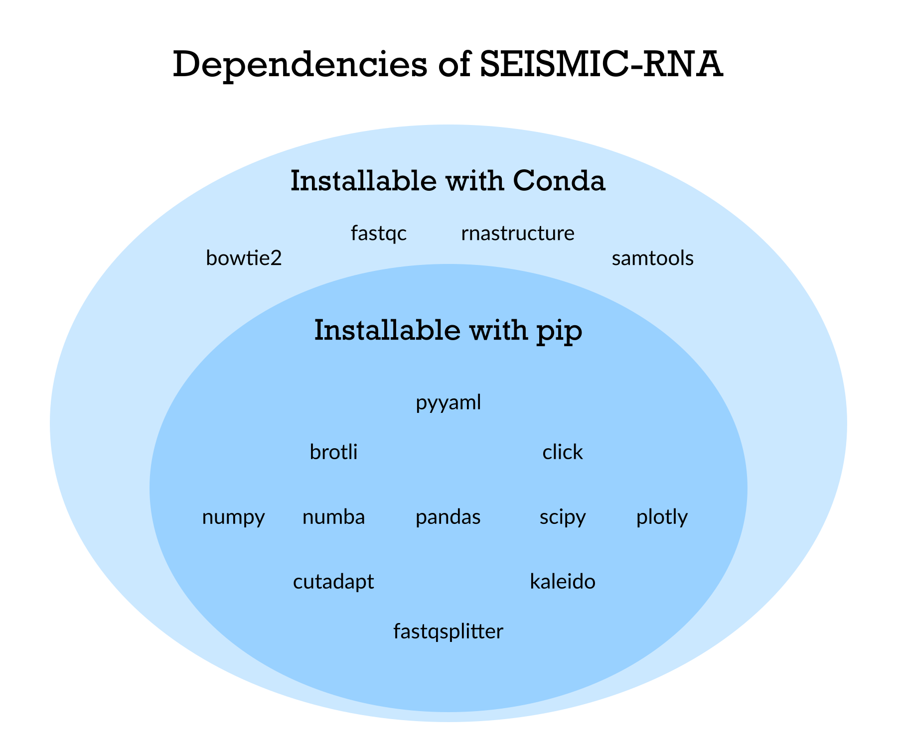

********************************************************************************
Install
********************************************************************************

System Requirements
================================================================================

SEISMIC-RNA runs on Linux and macOS.
If you use Windows, we recommend installing and running SEISMIC-RNA using the
`Windows Subsystem for Linux (WSL)`_.

.. note::

    SEISMIC-RNA will run on Apple Silicon (M1, M2, M3, etc.) ARM processors, but
    installation with Conda may not work.
    If that happens to you, see :ref:`conda_install_fails`.

We recommend the following hardware specifications, depending on your usage:

================ =========== ==== ======== ============
Reads (millions) Length (kb) CPUs RAM (GB) Storage (GB)
================ =========== ==== ======== ============
              <1          <1    4        8           16
            1-10         1-3    8       16           32
          10-100        3-10   16       32           64
            ≥100         ≥10  ≥32      ≥64         ≥128
================ =========== ==== ======== ============

Option 1: Install with Conda, if you already know how to use it
================================================================================

SEISMIC-RNA is available from the Bioconda_ channel and compatible with Python
3.11 and later.

To install, type this into a terminal::

    conda create -n seismic python=3.12
    conda activate seismic
    conda install -c bioconda -c conda-forge seismic-rna

If installing with Conda fails, then try :ref:`conda_install_fails`.

After you have installed SEISMIC-RNA, :ref:`set_datapath` and (optionally)
:ref:`test_seismicrna`.

Option 2: Install with Conda, if you don't know how to use it
================================================================================

Conda provides the easiest way to install SEISMIC-RNA.
These steps explain how to install Conda, SEISMIC-RNA, and its dependencies.

Step 1: Install Conda
--------------------------------------------------------------------------------

Installing SEISMIC-RNA is easiest with Conda_, a popular package manager.
If you don't already have Conda, then we recommend installing a small version of
it called Miniconda_.
When the installer asks if you want to initialize Conda, choose yes.
Otherwise, you can initialize Conda later by typing the path to your ``conda``
executable followed by ``init``, e.g. ::

    ~/miniconda3/bin/conda init

.. note::

    Another popular package manage is Mamba_, which is a drop-in replacement 
    for Conda reimplemented in C++. It can be much faster than Conda in the
    event you plan to install any additional packages alongside SEISMIC-RNA.
    If you wish to use Mamba instead of Conda, simply install Mamba and
    replace all instances of the ``conda`` command in this documentation
    with ``mamba``. The default installation location of Mamba is 
    ``~/miniforge3/bin/mamba``

Step 2: Create a Conda environment for SEISMIC-RNA
--------------------------------------------------------------------------------

Once Conda is installed, create a new virtual environment into which SEISMIC-RNA
and all other necessary software will go::

    conda create -n seismic python=3.12

You can name your environment whatever you like using the ``-n`` option; in this
example, it is named ``seismic``.

.. note::

    We recommend giving your environment a short name because you will need to
    type its name every time before using it.

You must indicate which version of Python to use; we recommend the most recent
stable release (currently version 3.12), though SEISMIC-RNA is compatible with
version 3.11 and later.

Step 3: Activate the Conda environment for SEISMIC-RNA
--------------------------------------------------------------------------------

Before you install SEISMIC-RNA into the Conda environment, you must "activate"
the environment by typing ``conda activate`` followed by its name, e.g. ::

    conda activate seismic

.. warning::

    Make sure to activate the environment for SEISMIC-RNA before installing any
    packages for SEISMIC-RNA.
    If you don't, then you will instead install the packages into whichever
    environment was already active, which would not only unintentionally alter
    this environment but also fail to install the packages into the ``seismic``
    environment.

Step 4: Install SEISMIC-RNA and its dependencies
--------------------------------------------------------------------------------

Run this command to install SEISMIC-RNA and all other software it requires::

    conda install -c bioconda -c conda-forge seismic-rna

If installing with Conda fails, then try :ref:`conda_install_fails`.

After you have installed SEISMIC-RNA, :ref:`set_datapath` and (optionally)
:ref:`test_seismicrna`.

.. _conda_install_fails:

Option 3: Install with Conda, if ``conda install seismic-rna`` fails
================================================================================

Conda may fail to install SEISMIC-RNA if some dependencies are not compatible
with your hardware and/or operating system (especially for Apple Silicon).
If that happens, then first :ref:`install_dependencies` and subsequently
:ref:`install_seismicrna_without_conda`.

After you have installed SEISMIC-RNA, :ref:`set_datapath` and (optionally)
:ref:`test_seismicrna`.

Option 4: Install without Conda
================================================================================

Although Conda is the easiest means to install SEISMIC-RNA, it is not necessary.

First, if Python_ is not installed, then install the latest version.
Confirm that Python version 3.11 or later and pip_ are installed by typing the
following commands, one by one::

    python --version
    pip --version

After installing Python and pip, follow :ref:`install_dependencies` and then
:ref:`install_seismicrna_without_conda`.

After you have installed SEISMIC-RNA, follow :ref:`set_datapath` and optionally
:ref:`test_seismicrna`.

.. _install_update:

Option 5: Update to another version of SEISMIC-RNA
================================================================================

If you have already installed SEISMIC-RNA, you can install a different version
easily.

Option 5A: Update SEISMIC-RNA to the latest stable version
--------------------------------------------------------------------------------

Type this if you had initially installed SEISMIC-RNA with Conda::

    conda update -c bioconda -c conda-forge seismic-rna

or this if you had initially installed it with pip::

    pip install -U seismic-rna

After updating, it is a good idea to :ref:`test_seismicrna`.

Option 5B: Install a specific version of SEISMIC-RNA
--------------------------------------------------------------------------------

Type this if you had initially installed SEISMIC-RNA with Conda::

    conda install -c bioconda -c conda-forge seismic-rna=x.y.z

or this if you had initially installed it with pip::

    pip install seismic-rna==x.y.z

.. note::

    When specifying the version, use ``=`` with Conda and ``==`` with pip.

After updating, it is a good idea to run the tests (see :ref:`test_seismicrna`).

.. _install_dependencies:

Appendix 1: Install the dependencies of SEISMIC-RNA with or without Conda
================================================================================

Although most dependencies of SEISMIC-RNA are available from pip, four are not:

The easiest way to install them is with Conda, using the following commands:

============= =========================================================
Dependency    Command to install with Conda
============= =========================================================
Bowtie2_      ``conda install -c bioconda -c conda-forge bowtie2``
Fastp_        ``conda install -c bioconda -c conda-forge fastp``
RNAstructure_ ``conda install -c bioconda -c conda-forge rnastructure``
Samtools_     ``conda install -c bioconda -c conda-forge samtools``
============= =========================================================

If a package fails to install using Conda, or if you are not using Conda, then
follow its link above to find the instructions for installing it manually.

.. note::
    If you use macOS and install software without using Conda, then you will
    need to manually approve each piece of software before you can run it.
    (This limitation is a safety feature of macOS intended to reduce the risk of
    running malware accidentally.)
    To approve the software, type ``which [program]`` (replacing ``[program]``
    from an item on the list below) to find the path of the executable.
    Then in Finder, open the directory that contains the executable.

Confirm that each dependency is installed by running each of these commands,
one at a time::

    which bowtie2
    which fastp
    which ct2dot  # ct2dot is part of RNAstructure
    which samtools

If the dependency is installed, then it should print out the path to it.
If it says something like ``not found``, then the dependency is not installed.

.. _install_seismicrna_without_conda:

Appendix 2: Install SEISMIC-RNA without Conda
================================================================================

Option 2A: Install SEISMIC-RNA from the Python Package Index
--------------------------------------------------------------------------------

We recommend installing SEISMIC-RNA from the Python Package Index, which will
download the latest stable version that has been released.
In a terminal, type this command to install it and all its Python dependencies::

    pip install seismic-rna

Option 2B: Install SEISMIC-RNA from GitHub
--------------------------------------------------------------------------------

We do *not* recommend installing from GitHub unless you need the latest source
code (most users do not), which may be unstable or contain significant bugs.
In a terminal, navigate to the directory into which to install SEISMIC-RNA.
If Git_ is installed on your computer, then clone the GitHub repository::

    git clone https://github.com/rouskinlab/seismic-rna.git

Otherwise, open ``https://github.com/rouskinlab/seismic-rna`` in a web browser,
click "Code" then "Download ZIP", unzip the file after it has downloaded, and
move it to the directory where you want to keep the source code.

To install SEISMIC-RNA, type ``pip install`` followed by the path of the source
code directory that you downloaded, e.g. ::

    pip install ~/Downloads/seismic-rna

If you want to be able to modify the source code after you install SEISMIC-RNA
and have those changes come into effect, then add the flag ``-e``, e.g. ::

    pip install -e ~/Downloads/seismic-rna

Otherwise, you may delete the source code after installation to save space.

.. _set_datapath:

Appendix 3: Set the DATAPATH environment variable
================================================================================

RNAstructure_ requires an environment variable called ``DATAPATH`` to point to
the directory of thermodynamic data tables.
See https://rna.urmc.rochester.edu/Text/Thermodynamics.html for details.
SEISMIC-RNA should be able to guess the correct ``DATAPATH`` if RNAstructure was
installed manually from the website or with Conda, but it will log a warning
message to inform you that it had to guess.
To suppress this warning, you can create an environment variable called
``DATAPATH`` on your system.
To find the location of the data tables for RNAstructure, type ::

    seismic -q datapath

This command should print a message that begins with ``DATAPATH=``.
Add this entire line (including ``DATAPATH=``) to the end of your shell RC file:
``~/.bashrc`` on most Linux systems, ``~/.zshrc`` on most macOS systems.
Restart your terminal for the changes to take effect.
After restarting the terminal, confirm ``DATAPATH`` is set by typing ::

    echo $DATAPATH

which should print out the path to the data tables that you found previously.
Now the ``DATAPATH`` will be set automatically every time you open the terminal,
unless you remove or edit that line in your shell RC file.

.. _test_seismicrna:

Appendix 4: Test SEISMIC-RNA
================================================================================

SEISMIC-RNA comes with hundreds of tests to verify that it is working properly
on your system.
We recommend running the tests each time you install or update SEISMIC-RNA.

Step 1: Run SEISMIC-RNA's testing suite
--------------------------------------------------------------------------------

To run all the tests, type this::

    seismic test

To monitor the tests as they run, you can use verbose mode (option ``-v``).
In verbose mode, as each test finishes, it will print ``.`` if it succeeds,
``F`` if it fails, ``E`` if it errs, and ``s`` if it was skipped::

    seismic test -v

To print out the name of each test as it runs and check which tests succeed and
fail, you can use double-verbose mode::

    seismic test -vv

Step 2: Interpret the test results
--------------------------------------------------------------------------------

Regardless of the verbosity, if all tests succeed, then it will print a message
similar to this::

    Ran 903 tests in 196.699s

    OK

Otherwise, it will print the number of tests that failed and a message about
each failure.
If this happens, then first follow :ref:`install_update` to ensure you are using
the latest version of SEISMIC-RNA and its dependencies.
If your problem persists, then please report an issue (see :doc:`./issues` for
instructions).

.. _Conda: https://docs.conda.io/en/latest/
.. _Mamba: https://mamba.readthedocs.io/en/latest/
.. _Bioconda: https://bioconda.github.io/
.. _Git: https://git-scm.com/
.. _Miniconda: https://docs.anaconda.com/miniconda/
.. _pip: https://pip.pypa.io/en/stable/
.. _Python: https://www.python.org/downloads/
.. _Bowtie2: https://bowtie-bio.sourceforge.net/bowtie2/manual.shtml
.. _Fastp: https://github.com/OpenGene/fastp
.. _RNAstructure: https://rna.urmc.rochester.edu/RNAstructure.html
.. _Samtools: https://www.htslib.org/
.. _PyPI: https://pypi.org/project/seismic-rna/
.. _Anaconda: https://anaconda.org/bioconda/seismic-rna
.. _Windows Subsystem for Linux (WSL): https://learn.microsoft.com/en-us/windows/wsl
