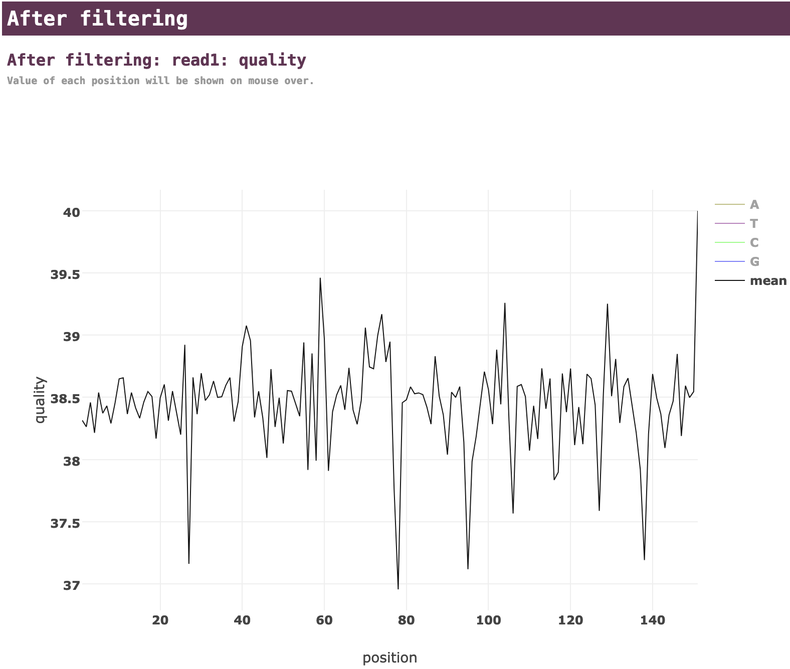
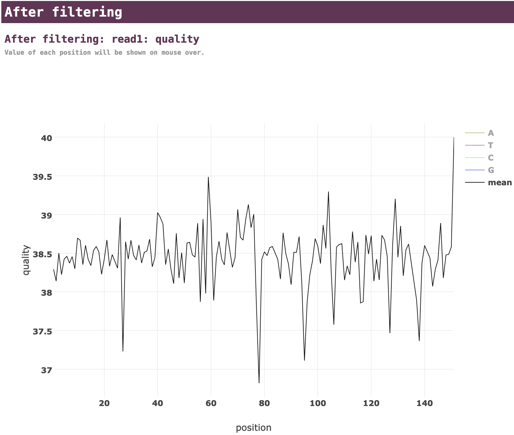

Tutorial 1: Amplicon prepared with RT-PCR
================================================================================

This tutorial demonstrates how to analyze a dataset that was prepared using
RT-PCR (with forward and reverse primers) of one specific section of an RNA.

TL;DR
--------------------------------------------------------------------------------

#. Download https://raw.githubusercontent.com/rouskinlab/seismic-rna/main/src/userdocs/tutorials/amplicon/data.tar

#. Un-tar and enter the data directory::

    tar xvf data.tar
    cd data

#. Process the no-DMS control::

    seismic wf -x fq/nodms --keep-gu --mask-polya 0 --min-mut-gap 0 hiv-rre.fa

#. Process the DMS-treated replicates separately::

    seismic wf -x fq/dms1 -x fq/dms2 --mask-pos rre 176 -p rre GGAGCTTTGTTCCTTGGGTTCTTGG GGAGCTGTTGATCCTTTAGGTATCTTTC hiv-rre.fa
    seismic graph scatter out/dms[12]/table/rre/26-204/mask-per-pos.csv

#. Pool the replicates and process them together::

    seismic pool -P dms-pool out/dms[12]
    seismic wf --mask-pos rre 176 -p rre GGAGCTTTGTTCCTTGGGTTCTTGG GGAGCTGTTGATCCTTTAGGTATCTTTC --cluster --fold -q 0.95 hiv-rre.fa out/dms-pool/relate

Scientific premise
--------------------------------------------------------------------------------

The RNA in this example is a segment of the the human immunodeficiency virus 1
(HIV-1) genome called the Rev response element (RRE), which binds to the protein
Rev that mediates nuclear export (`Sherpa et al.`_).
The RRE RNA folds into two different secondary structures: a predominant (~75%)
structure with 5 stems and a minor (~25%) structure with 4 stems, each of which
is associated with a different rate of HIV-1 replication.

In this hypothetical experiment, you *in vitro* transcribe a 232 nt segment of
the RRE, perform two DMS-MaPseq experiments on it (along with a no-DMS control),
amplify a section using RT-PCR, and sequence the amplicons using paired-end 150
x 150 nt read lengths.

*The FASTQ files in this tutorial were actually generated using ``seismic +sim``
and don't resemble the authentic DMS mutational patterns.

Download example files of an amplicon
--------------------------------------------------------------------------------

Download the example FASTA and FASTQ files.
First, open your terminal and navigate to a directory in which you want to run
the tutorial.

If you have ``wget``, you can download the tutorial data simply by typing ::

    wget https://raw.githubusercontent.com/rouskinlab/seismic-rna/main/src/userdocs/tutorials/amplicon/data.tar

Otherwise, click this link to download the tutorial data:
https://raw.githubusercontent.com/rouskinlab/seismic-rna/main/src/userdocs/tutorials/amplicon/data.tar

To ensure the download is complete and not corrupted, verify that the SHA-256
checksum is ``00c500bc9458048af04ee09b397a59e829fa25c7a53ba6c1b5cc09cbf80cd6ee``
by typing this command::

    shasum -a 256 data.tar

If this command prints a different checksum, then retry the download.
If the problem persists, then raise an issue (see :doc:`../../issues`).

After downloading and verifying the data, untar the data by typing ::

    tar xvf data.tar

and then navigate into the ``data`` directory::

    cd data

Process the no-DMS control
--------------------------------------------------------------------------------

When you have a no-DMS control, it is a good idea to analyze it first to check
if any bases are highly mutated: such bases would give falsely high mutation
rates and should be ignored while analyzing DMS-modified samples.

Run the workflow on the no-DMS control
^^^^^^^^^^^^^^^^^^^^^^^^^^^^^^^^^^^^^^^^^^^^^^^^^^^^^^^^^^^^^^^^^^^^^^^^^^^^^^^^

Process the no-DMS control through the whole workflow with this command::

    seismic wf -x fq/nodms --keep-gu --mask-polya 0 --min-mut-gap 0 hiv-rre.fa

This is what each of the arguments does:

- ``wf`` means run the entire workflow.
- ``-x fq/nodms`` means search inside ``fq/nodms`` for pairs of FASTQ files of
  paired-end reads with mate 1 and mate 2 in separate files.
- ``--keep-gu`` means keep G and U bases (which do not react with DMS and should
  typically be masked out in DMS-modified samples).
- ``--mask-polya 0`` means do not mask out poly(A) sequences (which can produce
  artifacts in DMS-modified samples).
- ``--min-mut-gap 0`` means disable observer bias correction (which only appies
  to DMS-modified samples).
- ``hiv-rre.fa`` means use the sequence in this FASTA file as the reference
  (i.e. mutation-free) sequence for the RNA.

After it finishes running (which should take about one minute or less), all
output files will go into the directory ``out``.

Check the fastp report files for the no-DMS control
^^^^^^^^^^^^^^^^^^^^^^^^^^^^^^^^^^^^^^^^^^^^^^^^^^^^^^^^^^^^^^^^^^^^^^^^^^^^^^^^

First, check the quality of the sequencing data by examining the fastp report.
In a web browser, open ``out/nodms/align/fastp.html``.
The chart at the top summarizes the numbers of reads and bases, and several other
statistics before and after filtering.

    .. image:: img/nodms_fastp_summary.png

The most important fields are "Adapters" and "Quality".
"Adapters" counts the sequences that were idenfied as adapters and trimmed off.
Since this sample was an amplicon and longer than the read length, it contains
very few adapter sequences:

    .. image:: img/nodms_fastp_adapters.png

"Quality" before and after indicates the average quality of the base calls at
each position in the reads.
The quality should be consistently high, ideally at least 30 over the entire
sequence.

    .. image:: img/nodms_fastp_quality_before.png

The quality after trimming low-quality base calls should be similar or higher:

    .. image:: img/nodms_fastp_quality_after.png

Check the graphs of coverage and mutation rate for the no-DMS control
^^^^^^^^^^^^^^^^^^^^^^^^^^^^^^^^^^^^^^^^^^^^^^^^^^^^^^^^^^^^^^^^^^^^^^^^^^^^^^^^

Next, check the unambiguous count (i.e. how many base calls at each position
could be labeled unambiguously as either a match or a mutation).
Open ``out/nodms/graph/rre/full/profile_masked_n-count.html`` in a web broser.

- ``nodms`` is the sample
- ``rre`` is the reference (i.e. name of the RNA)
- ``full`` is the section of the reference you are looking at
- ``profile`` is the type of graph (a bar graph with position on the x-axis)
- ``masked`` means graph the data come from the Mask step
- ``n`` is the shorthand for "unambiguous"
- ``count`` means graph the *number* of reads

    .. image:: img/nodms_profile_masked_n-count.png

This graph shows that the number of unambiguous base calls at each position is
fairly even -- around 2,200 -- across all positions amplified by the primers
(56-222), which is expected for RT-PCR amplicons.
This graph also shows that each position has enough unambigous base calls
(>1,000) to obtain a reasonably accurate estimate of the mutation rate.

After confirming there are sufficient unambiguous base calls, view the mutation
rates by opening ``out/nodms/graph/rre/full/profile_masked_m-ratio-q0.html``
in a web browser.

- ``nodms``, ``rre``, ``full``, ``profile``, and ``masked`` have the same
  meanings as before
- ``m`` is the shorthand for "mutated"
- ``ratio`` means graph the *ratio* of ``m`` (mutated) to unambiguously mutated
  or matching base calls (i.e. the mutation rate)
- ``q0`` means do not normalize the mutation rates

    .. image:: img/nodms_profile_masked_m-ratio.png

This graph shows that the mutation rate is very low across all positions -- as
expected for a sample that is not DMS-modified -- except for position 176, which
has a mutation rate of nearly 50%.
Because of this one outlier, it is hard to see just how low the mutation rates
are at the other positions, but because this graph is interactive, you can click
at the top of the y-axis and enter a new upper limit, such as 0.02.
You can also mouse over a bar to see its mutation rate (G31 is shown here).

    .. image:: img/nodms_profile_masked_m-ratio-0.02.png

Now it is clear that every position except 176 has a mutation rate no greater
than 1%, and most are below 0.5%, which is typical for non-DMS-modified RNA.

To figure out why position 176 has such a high mutation rate, you can check the
types of mutations that occur at each position, which are in another graph,
``out/nodms/graph/rre/full/profile_masked_acgtdi-ratio-q0.html``.

- ``nodms``, ``rre``, ``full``, ``profile``, ``masked``, ``ratio``, and ``q0``
  have the same meanings as before
- ``acgtdi`` are the shorthands for substitutions to A, C, G, and T; deletions;
  and insertions; respectively

    .. image:: img/nodms_profile_masked_acgtdi-ratio.png

This graph shows that nearly all (~97%) of the mutations at position 176 are
A-to-G substitutions.
This finding suggests (given that this hypothetical experiment is *in vitro*)
that the DNA template that was used to transcribe the RNA could actually be a
mixture of about 50% the expected sequence and 50% that sequence with an A-to-G
substitution at position 176.

Mask out the position that is highly mutated in the no-DMS sample
^^^^^^^^^^^^^^^^^^^^^^^^^^^^^^^^^^^^^^^^^^^^^^^^^^^^^^^^^^^^^^^^^^^^^^^^^^^^^^^^

If this were a real experiment, it could be worth sequencing the DNA template
to check if it actually was a mixture, and if so to fix it.
For the purposes of this tutorial, you will learn how to mask out position 176
so that it does not skew the results.

Rerun the workflow with the option ``--mask-pos rre 176``::

    seismic wf --force --keep-gu --mask-polya 0 --min-mut-gap 0 --mask-pos rre 176 hiv-rre.fa out/nodms/relate/rre

This is what each of the arguments does:

- ``wf`` means run the entire workflow.
- ``--force`` means overwrite any output files that already exist.
- ``--keep-gu`` means keep G and U bases (which do not react with DMS and should
  typically be masked out in DMS-modified samples).
- ``--mask-polya 0`` means do not mask out poly(A) sequences (which can produce
  artifacts in DMS-modified samples).
- ``--min-mut-gap 0`` means disable observer bias correction (which only appies
  to DMS-modified samples).
- ``--mask-pos rre 176`` means mask position 176 in reference ``rre``.
- ``hiv-rre.fa`` means use the sequence in this FASTA file as the reference
  (i.e. mutation-free) sequence for the RNA.
- ``out/nodms/relate/rre`` means search this directory for data files: in this
  case, the data from the Relate step for sample ``nodms``, reference ``rre``.

After the command finishes running, you can see that position 176 was masked out
by opening ``out/nodms/graph/rre/full/profile_masked_m-ratio-q0.html`` (position
175 is highlighted to make the gap between it and position 177 more clear):

    .. image:: img/nodms_profile_masked-176_m-ratio.png

Process both DMS-modified replicates
--------------------------------------------------------------------------------

Now you are ready to process the DMS-modified samples.

Run the workflow on both DMS-treated replicates
^^^^^^^^^^^^^^^^^^^^^^^^^^^^^^^^^^^^^^^^^^^^^^^^^^^^^^^^^^^^^^^^^^^^^^^^^^^^^^^^

Process the DMS-treated samples through the whole workflow with this command::

    seismic wf -x fq/dms1 -x fq/dms2 --mask-pos rre 176 -p rre GGAGCTTTGTTCCTTGGGTTCTTGG GGAGCTGTTGATCCTTTAGGTATCTTTC hiv-rre.fa

This is what each of the arguments does:

- ``wf`` means run the entire workflow.
- ``-x fq/dms1`` means search inside ``fq/dms1`` for pairs of FASTQ files of
  paired-end reads with mate 1 and mate 2 in separate files.
- ``-x fq/dms2`` means search inside ``fq/dms2`` for pairs of FASTQ files of
  paired-end reads with mate 1 and mate 2 in separate files.
- ``--mask-pos rre 176`` means mask position 176 (because it had a high mutation
  rate in the no-DMS sample).
- ``-p rre GGAGCTTTGTTCCTTGGGTTCTTGG GGAGCTGTTGATCCTTTAGGTATCTTTC`` defines a
  section of the reference ``rre`` that corresponds to the amplicon flanked by
  primers ``GGAGCTTTGTTCCTTGGGTTCTTGG`` and ``GGAGCTGTTGATCCTTTAGGTATCTTTC``.
- ``hiv-rre.fa`` means use the sequence in this FASTA file as the reference
  (i.e. mutation-free) sequence for the RNA.

Check the fastp report files for the DMS-treated replicates
^^^^^^^^^^^^^^^^^^^^^^^^^^^^^^^^^^^^^^^^^^^^^^^^^^^^^^^^^^^^^^^^^^^^^^^^^^^^^^^^

As with the no-DMS control sample, it is a good idea to open the fastp reports
for the DMS-treated samples and at least check the quality after trimming:

- ``out/dms1/align/fastp.html``

- ``out/dms2/align/fastp.html``

Check the correlation of mutation rates between DMS-treated replicates
^^^^^^^^^^^^^^^^^^^^^^^^^^^^^^^^^^^^^^^^^^^^^^^^^^^^^^^^^^^^^^^^^^^^^^^^^^^^^^^^

Next, it is recommended to check the correlation of mutation rates between the
replicates, to ensure they are reproducible.
To create a scatter plot of the mutation rates and calculate the correlation,
run the command ::

    seismic graph scatter out/dms[12]/table/rre/26-204/mask-per-pos.csv

- ``graph scatter`` means graph a scatter plot.
- ``out/dms[12]/table/rre/26-204/mask-per-pos.csv`` means graph data from these
  tables, where ``[12]`` is a `glob pattern`_ that is automatically expanded by
  the shell into all files that match the pattern -- which in this case is
  ``out/dms1/table/rre/26-204/mask-per-pos.csv out/dms2/table/rre/26-204/mask-per-pos.csv``.
  You could instead type this expression to list both table files explicitly,
  but the former requires fewer key strokes.

Open ``out/dms1__and__dms2/graph/rre/full/scatter_masked_m-ratio-q0.html`` in a
web browser to view the scatter plot and correlation:

    .. image:: img/dms1__and__dms2_scatter_masked_m-ratio.png

The Pearson correlation is 0.998, which is extremely high.
(For a general amplicon, ≥0.98 would be ideal, and ≥0.95 would be decent).

Pool the DMS-treated replicates and process them together
--------------------------------------------------------------------------------

Pool the two DMS-treated replicates
^^^^^^^^^^^^^^^^^^^^^^^^^^^^^^^^^^^^^^^^^^^^^^^^^^^^^^^^^^^^^^^^^^^^^^^^^^^^^^^^

Because the correlation is so high, the data from the replicates can be combined
so that they can be analyzed as a single sample, which is helpful whenever high
coverage is necessary, such as during clustering.
To combine the replicates, run this command::

    seismic pool -P dms-pool out/dms[12]

- ``pool`` means combine samples into a new "pooled" sample.
- ``-P dms-pool`` means name the pooled sample ``dms-pool``.
- ``out/dms[12]`` means pool the samples in these directories, where ``[12]``
  is a `glob pattern`_ that is automatically expanded by the shell into all
  files that match the pattern -- which in this case is ``out/dms1 out/dms2``.
  You could instead type this expression to list both table files explicitly,
  but the former requires fewer key strokes.

Process the pooled DMS-treated samples
^^^^^^^^^^^^^^^^^^^^^^^^^^^^^^^^^^^^^^^^^^^^^^^^^^^^^^^^^^^^^^^^^^^^^^^^^^^^^^^^

Now that the replicates are pooled, the overall coverage will be higher, and so
clustering is more likely to detect true alternative structures.
Process the pooled sample, including with clustering, by running this command::

    seismic wf --mask-pos rre 176 -p rre GGAGCTTTGTTCCTTGGGTTCTTGG GGAGCTGTTGATCCTTTAGGTATCTTTC --cluster --fold -q 0.95 hiv-rre.fa out/dms-pool/relate

This is what each of the arguments does:

- ``wf`` means run the entire workflow.
- ``--mask-pos rre 176`` means mask position 176 (because it had a high mutation
  rate in the no-DMS sample).
- ``-p rre GGAGCTTTGTTCCTTGGGTTCTTGG GGAGCTGTTGATCCTTTAGGTATCTTTC`` defines a
  section of the reference ``rre`` that corresponds to the amplicon flanked by
  primers ``GGAGCTTTGTTCCTTGGGTTCTTGG`` and ``GGAGCTGTTGATCCTTTAGGTATCTTTC``.
- ``--cluster`` means enable clustering to find alternative structures.
- ``--fold`` means enable secondary structure prediction.
- ``-q 0.95`` sets the 95th percentile of the mutation rates to 1 and scales the
  rest of the data accordingly (required if using ``--fold``).
- ``hiv-rre.fa`` means use the sequence in this FASTA file as the reference
  (i.e. mutation-free) sequence for the RNA.
- ``out/dms-pool/relate`` means search inside ``out/dms-pool/relate`` for data
  to feed into the workflow: in this case, a report from the Relate step.

.. _Sherpa et al.: https://doi.org/10.1093/nar/gkv313
.. _glob pattern: https://en.wikipedia.org/wiki/Glob_(programming)
