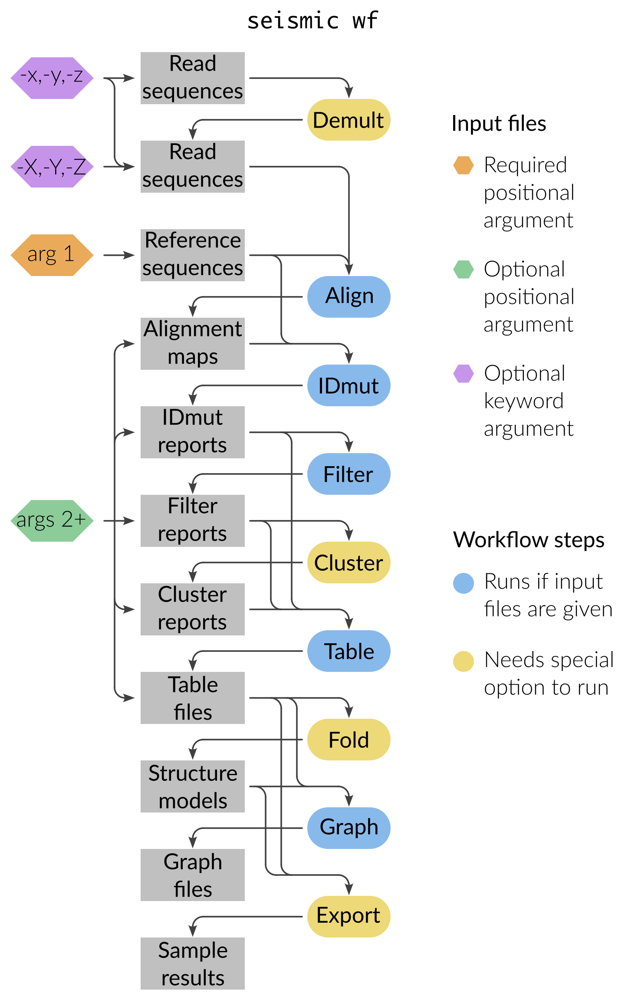

********************************************************************************
seismic wf
********************************************************************************

Purpose
================================================================================

``seismic wf`` runs the entire SEISMIC-RNA pipeline end-to-end, from FASTQ
files (or any later-stage input) through alignment, mutation identification,
filtering, clustering, table generation, structure prediction, graphing, and
optional export.
It is the only command most users need to invoke.

For each input file, ``wf`` resumes the pipeline from the step that produces
that file and runs everything downstream.
For example, a FASTQ goes through every step; a Filter report goes only
through Fold/Export/Graph.

.. note::

    By default, the Cluster, Fold, Draw, and Export steps **do not run**.
    Turn them on with ``--cluster``, ``--fold``, ``--draw``, and ``--export``
    respectively.

Inputs
================================================================================

Required
    A FASTA file of one or more reference sequences (first positional
    argument; see :doc:`/formats/data/fasta`).

Reads (any combination, optional)
    - ``-x`` paired-end reads in two separate FASTQ files
    - ``-y`` paired-end reads interleaved in one FASTQ file
    - ``-z`` single-end reads
    - ``-X`` / ``-Y`` / ``-Z`` same as above but for already-demultiplexed
      reads

Intermediate files (any combination, optional)
    Given as positional arguments after the FASTA:

    - SAM / BAM / CRAM alignment maps (see :doc:`/formats/data/xam`)
    - IDmut, Filter, Cluster, or Table reports (see
      :doc:`/formats/report/index`)
    - Table CSVs (skip directly to Fold / Export / Graph)

See :doc:`/use/inputs` for ways to list many input files at once (glob
patterns, directory recursion, mixed positional and keyword inputs).

Outputs
================================================================================

``seismic wf`` runs each step into the output directory given by
``--out-dir`` (default ``./out``).
Most output paths are structured ``{out}/{sample}/{step}/{ref}/{region}/...``.
Refer to each step for the specific output structure: :doc:`align`,
:doc:`idmut`, :doc:`filter`, :doc:`cluster`, :doc:`table`, :doc:`fold`,
:doc:`graph`, :doc:`draw`, :doc:`collate`, :doc:`export`.

Quick example
================================================================================

Run the entire pipeline on a paired-end FASTQ pair against ``refs.fa``::

    seismic wf -x sampleA_R1.fq -x sampleA_R2.fq refs.fa

Run with clustering, folding, and export turned on::

    seismic wf --cluster --fold --export -x sampleA_R1.fq -x sampleA_R2.fq refs.fa

Resume from existing alignment maps and existing IDmut reports::

    seismic wf refs.fa out/sampleA/align/refX.bam out/*/idmut/refY/idmut-report.json

Options
================================================================================

Optional steps
    - ``--cluster`` / ``--no-cluster`` — run the Cluster step (default: off).
    - ``--fold`` / ``--no-fold`` — run the Fold step (default: off).
    - ``--draw`` / ``--no-draw`` — run the Draw step (default: off).
    - ``--export`` / ``--no-export`` — run the Export step (default: off).
    - ``--max-clusters`` / ``-k`` — maximum number of clusters to try once the
      Cluster step runs (default: 0, i.e. no limit). Giving ``-k`` a positive
      number also turns on the Cluster step.

Per-step options
    Every option accepted by any individual pipeline command can be given
    to ``seismic wf``, except for ``--branch`` (use ``--wf-branch`` instead;
    see Branches below).
    For the complete list of options and what each does, see the per-step
    pages (:doc:`align`, :doc:`idmut`, :doc:`filter`, :doc:`cluster`,
    :doc:`table`, :doc:`fold`, :doc:`graph`, :doc:`draw`, :doc:`collate`,
    :doc:`export`) and the auto-generated :doc:`/cli`.

Branches
    ``--wf-branch STEP NAME``
        Run one step of the workflow under a branch, writing its outputs to
        ``{out}/{sample}/{STEP}_{NAME}/`` instead of the default directory.
        Give the step name followed by the branch name, and repeat the option
        to branch several steps, e.g.
        ``--wf-branch filter strict --wf-branch cluster strict``.
        ``STEP`` must be one of ``demult``, ``align``, ``idmut``, ``filter``,
        ``filterscan``, ``cluster``, ``clusterscan``, or ``fold``; any other
        name raises an error.
        See :doc:`/use/branch`.

Global options
    - ``--out-dir`` — output directory (default ``./out``).
    - ``--num-cpus`` — number of parallel processes
      (see :doc:`/use/parallel`).
    - ``--force`` — overwrite existing output files.

Options and positional arguments can be mixed freely on the command line.

Caveats
================================================================================

- The optional steps (Cluster, Fold, Draw, Export) are off by defaults.
- The FASTA file must contain the same references as those used for any
  pre-existing BAM files or reports given as input.
  Mismatched references cause the IDmut step to fail; see :doc:`idmut`.
- All inputs and outputs share a single ``--out-dir``.  Re-running ``wf``
  against the same ``--out-dir`` without ``--force`` will skip steps whose
  outputs already exist (issuing a warning for each existing output file).

Performance tips
================================================================================

- Use ``--num-cpus N`` to parallelize across reads and references; see
  :doc:`/use/parallel`.
- For very large datasets, tune ``--batch-size`` (see :doc:`idmut`).
- Resume a partially-completed run by re-invoking ``wf`` with the same
  ``--out-dir``; only missing outputs are produced.

Common errors
================================================================================

``seismic wf`` delegates to the individual pipeline commands, so its error
messages come from whichever step failed.
See the per-step pages for the exceptions each step can raise:

- :doc:`align` — alignment errors (missing reference, Bowtie2 failure)
- :doc:`idmut` — reference mismatch, insufficient reads, mapping quality
- :doc:`filter` — region/probe errors
- :doc:`cluster` — convergence and clustering failures
- :doc:`fold` — RNAstructure ``DATAPATH`` not set (see
  :doc:`/install/index`)

Common unexpected results
================================================================================

No clustered outputs
    You forgot ``--cluster``.

No structure models
    You forgot ``--fold``.

No webapp JSON
    You forgot ``--export``.

Empty output for some references
    The Align step deletes BAM files that contain fewer than ``--min-reads``
    reads (default 1000) to prevent cluttering the output directory with BAM
    files that are too small to be useful in downstream steps. 

``wf`` did not run a step you expected
    Confirm what inputs you passed. ``wf`` only runs the steps that recognize
    an input file you provided. For example, passing a table CSV file from the
    IDmut step (``idmut-pos-table.csv``) will not trigger the Filter step
    because Filter only accepts IDmut report JSON files (``idmut-report.json``).

See also
================================================================================

- :doc:`/use/inputs` — how to list many input files
- :doc:`/use/parallel` — how parallelism works
- :doc:`/use/logging` — controlling verbosity and log files
- :doc:`/use/branch` — run variant analyses under a different name
- :doc:`/works/index` — visual tour of each pipeline step
- :doc:`/tutorials/index` — step-by-step worked examples
