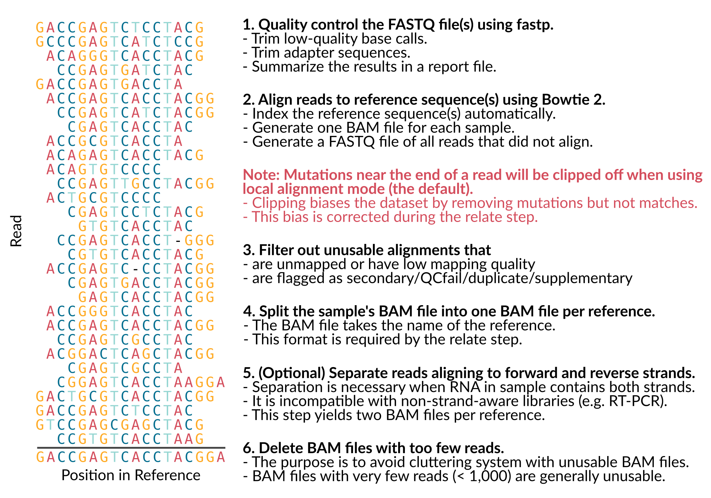
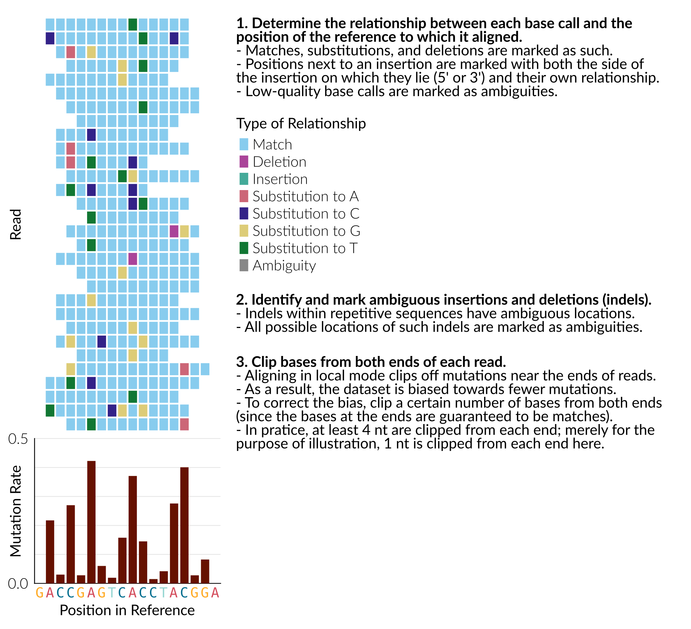
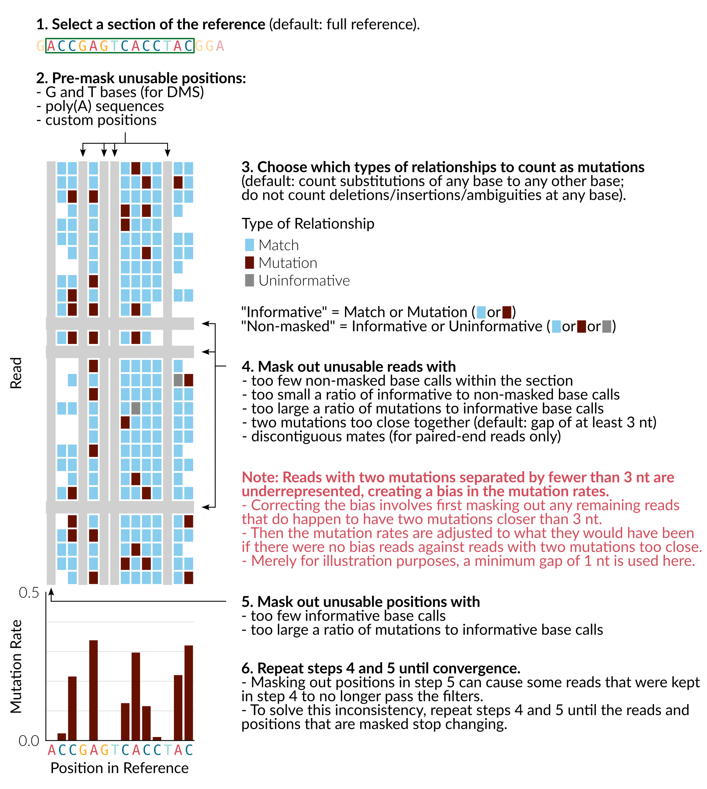
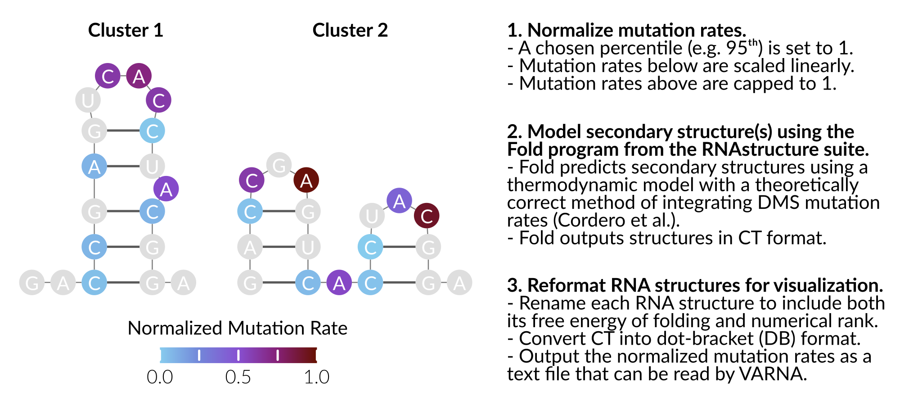

********************************************************************************
How SEISMIC-RNA Works
********************************************************************************

SEISMIC-RNA fully processes mutational profiling data from raw sequencing reads
to finished structure models and graphs.
These figures illustrate what happens during each step of data processing.

FASTQ files
================================================================================

.. image::
    reads.png

seismic align
================================================================================

seismic relate
================================================================================

seismic mask
================================================================================

seismic cluster
================================================================================

.. image::
    cluster.png

seismic fold
================================================================================

